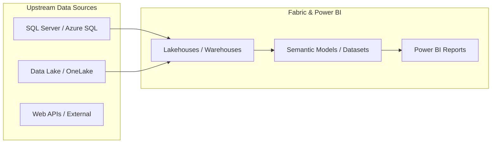

# Data Lineage & Dependencies Map

This document tracks how data flows from source systems into semantic models and downstream reports.

## Lineage Overview Diagram (Mermaid)

## Complete Lineage Connections Table

| Workspace | Upstream Source | Connection | Target Item | Target Type |
| :--- | :--- | :--- | :--- | :--- |
| **BI_TMINT_Occupancy** | `SharePointList` | `{'url': 'https://titanmachiner` | **Occupancy** | `Semantic Model` |
| **BI_TMINT_Occupancy** | `Extension` | `{'path': 'UsageMetricsDataConn` | **Usage Metrics Report** | `Semantic Model` |
| **BI_TMINT_Occupancy** | `436ed979-95d0-453a-95ed-a67c5ca1500f` | `Dataset Link` | **Occupancy** | `Power BI Report` |
| **BI_TMINT_Occupancy** | `436ed979-95d0-453a-95ed-a67c5ca1500f` | `Dataset Link` | **TMU Occupancy Report** | `Power BI Report` |
| **BI_TMINT_Occupancy** | `837d9537-cd25-41d6-acb6-909ee92508d1` | `Dataset Link` | **Usage Metrics Report** | `Power BI Report` |
| **BI_TMINT_Parts** | `Sql` | `{'server': '10.75.1.7', 'datab` | **Parts - Aging (old)** | `Semantic Model` |
| **BI_TMINT_Parts** | `Sql` | `{'server': '10.75.1.7', 'datab` | **Parts - Aging** | `Semantic Model` |
| **BI_TMINT_Parts** | `Sql` | `{'server': '10.75.1.7', 'datab` | **Parts - Aging - EndOfMonth** | `Semantic Model` |
| **BI_TMINT_Parts** | `Extension` | `{'path': 'UsageMetricsDataConn` | **Usage Metrics Report** | `Semantic Model` |
| **BI_TMINT_Parts** | `Sql` | `{'server': '10.75.1.7', 'datab` | **TMR Stock Order Report** | `Semantic Model` |
| **BI_TMINT_Parts** | `Sql` | `{'server': 'titaneu.database.w` | **TMR Stock Order Report** | `Semantic Model` |
| **BI_TMINT_Parts** | `5df8ba3b-557c-4409-ad17-a528d8024276` | `Dataset Link` | **TMINT_BI_Inventory_Aging_Report** | `Power BI Report` |
| **BI_TMINT_Parts** | `b93d3337-f9a4-427e-a9cd-d49e02274930` | `Dataset Link` | **TMINT_BI_Preventive_Aging_Report** | `Power BI Report` |
| **BI_TMINT_Parts** | `05a71bc2-cd63-4fa2-8911-a1df65335625` | `Dataset Link` | **Parts - Aging** | `Power BI Report` |
| **BI_TMINT_Parts** | `ff2706e7-600c-4c95-b327-a11fd5c1a342` | `Dataset Link` | **Parts - Aging - EndOfMonth** | `Power BI Report` |
| **BI_TMINT_Parts** | `e3e38f8b-bed7-4248-bd79-2716063255dd` | `Dataset Link` | **Usage Metrics Report** | `Power BI Report` |
| **BI_TMINT_Parts** | `593e97f2-ab3e-46e4-95f5-ffa12ce25963` | `Dataset Link` | **TMR Stock Order Report** | `Power BI Report` |
| **BI_TMB_OPSpackage** | `Sql` | `{'server': '10.75.1.7', 'datab` | **TMB OPS Package** | `Semantic Model` |
| **BI_TMB_OPSpackage** | `Extension` | `{'path': 'PowerPlatformDataflo` | **TMB OPS Package** | `Semantic Model` |
| **BI_TMB_OPSpackage** | `AnalysisServices` | `{'server': 'powerbi://api.powe` | **TMB OPS Package** | `Semantic Model` |
| **BI_TMB_OPSpackage** | `Sql` | `{'server': 'cwgz5ola5r6u5e4heu` | **TMB OPS Package** | `Semantic Model` |
| **BI_TMB_OPSpackage** | `Sql` | `{'server': 'cwgz5ola5r6u5e4heu` | **TMB OPS Package** | `Semantic Model` |
| **BI_TMB_OPSpackage** | `25029823-27bf-4fbf-ac11-9d0cf33445d0` | `Dataset Link` | **TMB OPS Package** | `Power BI Report` |
| **BI_TMB_OPSpackage** | `754588d4-8706-4344-bb2c-11e83df40ac8` | `Dataset Link` | **Report Usage Metrics Report** | `Power BI Report` |
| **BI_TMEU_InventoryBook** | `Sql` | `{'server': 'tmweupautosql01.da` | **TMEU Inventory Book** | `Semantic Model` |
| **BI_TMEU_InventoryBook** | `Extension` | `{'path': 'UsageMetricsDataConn` | **Usage Metrics Report** | `Semantic Model` |
| **BI_TMEU_InventoryBook** | `efdfa2d7-db45-41fc-b60f-4af20f293e5f` | `Dataset Link` | **TMEU Inventory Book** | `Power BI Report` |
| **BI_TMEU_InventoryBook** | `11b91048-04e6-48fe-bc7b-30bb30c9dd62` | `Dataset Link` | **Report Usage Metrics Report** | `Power BI Report` |
| **BI_TMEU_InventoryBook** | `ecb50ee4-c1bc-48a1-b62f-d5030e5bc1d2` | `Dataset Link` | **Usage Metrics Report** | `Power BI Report` |
| **BI_TMEU_InventoryBook** | `efdfa2d7-db45-41fc-b60f-4af20f293e5f` | `Dataset Link` | **Inventory Book Value on Aged** | `Power BI Report` |
| **BI_TMINT_PST** | `SharePointList` | `{'url': 'https://titanmachiner` | **TMINT_PST** | `Semantic Model` |
| **BI_TMINT_PST** | `SharePointList` | `{'url': 'https://titanmachiner` | **TMINT_PST** | `Semantic Model` |
| **BI_TMINT_PST** | `Extension` | `{'path': 'UsageMetricsDataConn` | **Usage Metrics Report** | `Semantic Model` |
| **BI_TMINT_PST** | `561bbce5-3376-490c-94b5-14cf91476f1b` | `Dataset Link` | **TMINT_PST** | `Power BI Report` |
| **BI_TMINT_PST** | `c369142c-2a06-4782-91ec-05d950c60fac` | `Dataset Link` | **Usage Metrics Report** | `Power BI Report` |
| **BI_IT_Intercompany_Cost_Report** | `SharePointList` | `{'url': 'https://titanmachiner` | **IT Service and Fee Overview Report** | `Semantic Model` |
| **BI_IT_Intercompany_Cost_Report** | `AnalysisServices` | `{'server': 'powerbi://api.powe` | **IT Service and Fee Overview Report** | `Semantic Model` |
| **BI_IT_Intercompany_Cost_Report** | `Sql` | `{'server': 'cwgz5ola5r6u5e4heu` | **IT Service and Fee Overview Report** | `Semantic Model` |
| **BI_IT_Intercompany_Cost_Report** | `SharePointList` | `{'url': 'https://titanmachiner` | **Direct_IT Service and Fee Overview Report** | `Semantic Model` |
| **BI_IT_Intercompany_Cost_Report** | `Extension` | `{'path': 'Enrollment Number;72` | **Direct_IT Service and Fee Overview Report** | `Semantic Model` |
| **BI_IT_Intercompany_Cost_Report** | `Web` | `{'url': 'https://management.az` | **Direct_IT Service and Fee Overview Report** | `Semantic Model` |
| **BI_IT_Intercompany_Cost_Report** | `Extension` | `{'path': 'UsageMetricsDataConn` | **Usage Metrics Report** | `Semantic Model` |
| **BI_IT_Intercompany_Cost_Report** | `a5afe3f8-9b4f-4edc-a49b-d6ebbbede8c1` | `Dataset Link` | **IT Service and Fee Overview Report** | `Power BI Report` |
| **BI_IT_Intercompany_Cost_Report** | `79ac26e9-a25a-4ae9-920e-285609e55548` | `Dataset Link` | **Direct_IT Service and Fee Overview Report** | `Power BI Report` |
| **BI_IT_Intercompany_Cost_Report** | `b6058f61-abb1-4a9c-b1e9-3edf596b0e10` | `Dataset Link` | **Usage Metrics Report** | `Power BI Report` |
| **INT_OrderBook** | `Sql` | `{'server': 'tmweupautosql01.da` | **TMEU Order Book** | `Semantic Model` |
| **INT_OrderBook** | `Extension` | `{'path': 'UsageMetricsDataConn` | **Usage Metrics Report** | `Semantic Model` |
| **INT_OrderBook** | `676d038b-1e37-490f-afea-46da8c26ef54` | `Dataset Link` | **Report Usage Metrics Report** | `Power BI Report` |
| **INT_OrderBook** | `07024adf-0fbc-4c8f-848e-fb8464baa1e2` | `Dataset Link` | **Dashboard Usage Metrics Report** | `Power BI Report` |
| **INT_OrderBook** | `ececf465-b70c-4c6d-a5c9-f2d30cd5a0a2` | `Dataset Link` | **TMEU Order Book** | `Power BI Report` |
| **INT_OrderBook** | `8a47e46b-0bdb-4fc8-b855-275ceeb3dde5` | `Dataset Link` | **Usage Metrics Report** | `Power BI Report` |
| **TMRO_Finance** | `Sql` | `{'server': 'titaneu.database.w` | **TMR_Stock_Balance_Parts_DP** | `Semantic Model` |
| **TMRO_Finance** | `Sql` | `{'server': 'titaneu.database.w` | **TMR_Stock_Balance_Equip_DP** | `Semantic Model` |
| **TMRO_Finance** | `Sql` | `{'server': 'titaneu.database.w` | **TMR_Notinvoiced_Documents_DateParameter** | `Semantic Model` |
| **TMRO_Finance** | `Sql` | `{'server': 'titaneu.database.w` | **TMR_Sales_Equipments** | `Semantic Model` |
| **TMRO_Finance** | `Sql` | `{'server': 'titaneu.database.w` | **TMR_Jobcards_Invoicing** | `Semantic Model` |
| **TMRO_Finance** | `Sql` | `{'server': 'titaneu.database.w` | **TMR_Mapping_Invoices_Payments** | `Semantic Model` |
| **TMRO_Finance** | `Sql` | `{'server': 'titaneu.database.w` | **TMR_Item_Ledger** | `Semantic Model` |
| **TMRO_Finance** | `Sql` | `{'server': 'titaneu.database.w` | **TMR_Not_Applied_Invoices_v2** | `Semantic Model` |
| **TMRO_Finance** | `Sql` | `{'server': 'titaneu.database.w` | **TMR_Parts_Stock_Balance_Reconcile_TB** | `Semantic Model` |
| **TMRO_Finance** | `Sql` | `{'server': 'titaneu.database.w` | **TMR_Parts_Reports** | `Semantic Model` |
| **TMRO_Finance** | `Sql` | `{'server': 'titaneu.database.w` | **TMR_Flash_Service** | `Semantic Model` |
| **TMRO_Finance** | `Sql` | `{'server': 'titaneu.database.w` | **TMR_Extended_Warranty** | `Semantic Model` |
| **TMRO_Finance** | `Sql` | `{'server': 'titaneu.database.w` | **TMR_Mapping_Service_Invoices_Offers** | `Semantic Model` |
| **TMRO_Finance** | `Sql` | `{'server': 'titaneu.database.w` | **TMR_Parts_Purchasing** | `Semantic Model` |
| **TMRO_Finance** | `Sql` | `{'server': 'titaneu.database.w` | **TMR_Buyback_Costs** | `Semantic Model` |
| **TMRO_Finance** | `Sql` | `{'server': '10.75.1.7', 'datab` | **Report TMR P&L _wip** | `Semantic Model` |
| **TMRO_Finance** | `File` | `{'path': 'c:\\titan\\bireporti` | **Report TMR P&L _wip** | `Semantic Model` |
| **TMRO_Finance** | `File` | `{'path': 'c:\\titan\\bireporti` | **Report TMR P&L _wip** | `Semantic Model` |
| **TMRO_Finance** | `Sql` | `{'server': 'titaneu.database.w` | **TMR_Cars_Expenses** | `Semantic Model` |
| **TMRO_Finance** | `Sql` | `{'server': 'titaneu.database.w` | **TMR_Open_Receivables_Group_Report** | `Semantic Model` |
| **TMRO_Finance** | `Sql` | `{'server': 'titaneu.database.w` | **TMR_Sales_70401** | `Semantic Model` |
| **TMRO_Finance** | `Sql` | `{'server': 'titaneu.database.w` | **TMR_P&L_DP** | `Semantic Model` |
| **TMRO_Finance** | `SharePointList` | `{'url': 'https://titanmachiner` | **TMR_P&L_DP_live** | `Semantic Model` |
| **TMRO_Finance** | `Sql` | `{'server': 'titaneu.database.w` | **TMR_P&L_DP_live** | `Semantic Model` |
| **TMRO_Finance** | `AnalysisServices` | `{'server': 'powerbi://api.powe` | **TMR_P&L_DP_live** | `Semantic Model` |
| **TMRO_Finance** | `Sql` | `{'server': 'titaneu.database.w` | **TMR_Core_Charges** | `Semantic Model` |
| **TMRO_Finance** | `Sql` | `{'server': 'titaneu.database.w` | **TMR_Extended_Warranty_Cons** | `Semantic Model` |
| **TMRO_Finance** | `Sql` | `{'server': '10.75.1.7', 'datab` | **Report TMR Aging_DP** | `Semantic Model` |
| **TMRO_Finance** | `Sql` | `{'server': 'titaneu.database.w` | **TMR_Jobcards_SLE_check** | `Semantic Model` |
| **TMRO_Finance** | `Sql` | `{'server': 'titaneu.database.w` | **TMR_GPS_Sales** | `Semantic Model` |
| **TMRO_Finance** | `Sql` | `{'server': 'titaneu.database.w` | **TMR_Equipments_Purchasing** | `Semantic Model` |
| **TMRO_Finance** | `Extension` | `{'path': 'UsageMetricsDataConn` | **Usage Metrics Report** | `Semantic Model` |
| **TMRO_Finance** | `Sql` | `{'server': 'titaneu.database.w` | **TMR_S&M_DQ** | `Semantic Model` |
| **TMRO_Finance** | `Sql` | `{'server': 'titaneu.database.w` | **TMR_Service_Invoices_Details** | `Semantic Model` |
| **TMRO_Finance** | `Sql` | `{'server': 'titaneu.database.w` | **TMR_Uninvoiced_Shipments_DQ** | `Semantic Model` |
| **TMRO_Finance** | `Sql` | `{'server': 'titaneu.database.w` | **TMR_E-Invoice** | `Semantic Model` |
| **TMRO_Finance** | `Sql` | `{'server': '10.75.1.7', 'datab` | **Test_DWH** | `Semantic Model` |
| **TMRO_Finance** | `Sql` | `{'server': '10.75.1.7', 'datab` | **Report Maintenance_wip** | `Semantic Model` |
| **TMRO_Finance** | `Sql` | `{'server': 'titaneu.database.w` | **TMR_Warranty_Report_DP** | `Semantic Model` |
| **TMRO_Finance** | `Sql` | `{'server': '10.75.1.7', 'datab` | **Report TMA Sales and Margin** | `Semantic Model` |
| **TMRO_Finance** | `Sql` | `{'server': 'titaneu.database.w` | **TMR_Utilities** | `Semantic Model` |
| **TMRO_Finance** | `Sql` | `{'server': '10.75.1.7', 'datab` | **Report TMR Price_Margin_25** | `Semantic Model` |
| **TMRO_Finance** | `Sql` | `{'server': 'titaneu.database.w` | **TMR_Partners** | `Semantic Model` |
| **TMRO_Finance** | `Sql` | `{'server': '10.75.1.7', 'datab` | **Report Stock&Sales WG** | `Semantic Model` |
| **TMRO_Finance** | `Sql` | `{'server': 'titaneu.database.w` | **TMR_BS_DP** | `Semantic Model` |
| **TMRO_Finance** | `Sql` | `{'server': 'titaneu.database.w` | **TMR_CostCenters_COGS_Service** | `Semantic Model` |
| **TMRO_Finance** | `Sql` | `{'server': '10.75.1.7', 'datab` | **Report TMA Sales and Margin_temp** | `Semantic Model` |
| **TMRO_Finance** | `f2e04e17-228d-4b52-bcb9-8649741f620a` | `Dataset Link` | **TMR_Stock_Balance_Parts_DP** | `Power BI Report` |
| **TMRO_Finance** | `2458199d-c761-4280-955d-e1e0488f8485` | `Dataset Link` | **TMR_Stock_Balance_Equip_DP** | `Power BI Report` |
| **TMRO_Finance** | `018e9201-c1fb-4601-b4d0-4a0f9bae68d7` | `Dataset Link` | **TMR_Notinvoiced_Documents_DateParameter** | `Power BI Report` |
| **TMRO_Finance** | `9c6ab3cc-4bec-4622-b34e-dd85a5867f32` | `Dataset Link` | **Report Usage Metrics Report** | `Power BI Report` |
| **TMRO_Finance** | `7d2a45fa-a717-4b4f-b5fe-e1c910cb9f54` | `Dataset Link` | **TMR_Sales_Equipments** | `Power BI Report` |
| **TMRO_Finance** | `4ab2838e-bc11-4a95-91d7-390c6614c08f` | `Dataset Link` | **TMR_Jobcards_Invoicing** | `Power BI Report` |
| **TMRO_Finance** | `f5bc55dc-2910-4b99-9241-5b9cbf16b5cb` | `Dataset Link` | **TMR_Mapping_Invoices_Payments** | `Power BI Report` |
| **TMRO_Finance** | `51b13f8b-5bc4-4f6e-b5a8-ee732de41c8f` | `Dataset Link` | **TMR_Item_Ledger** | `Power BI Report` |
| **TMRO_Finance** | `9c6ab3cc-4bec-4622-b34e-dd85a5867f32` | `Dataset Link` | **Usage_Report_TMROFinance_Workspace** | `Power BI Report` |
| **TMRO_Finance** | `7d026142-2f86-40c2-853d-38f16f48f0d3` | `Dataset Link` | **TMR_Not_Applied_Invoices_v2** | `Power BI Report` |
| **TMRO_Finance** | `337cd60e-6f77-4e50-b014-6da228f0e6f5` | `Dataset Link` | **TMR_Parts_Stock_Balance_Reconcile_TB** | `Power BI Report` |
| **TMRO_Finance** | `8b7d5962-5eae-459d-90f9-27bc115b4021` | `Dataset Link` | **TMR_Parts_Reports** | `Power BI Report` |
| **TMRO_Finance** | `d4d407a5-375b-4b4f-911c-5c1f3f8e9510` | `Dataset Link` | **TMR_Flash_Service** | `Power BI Report` |
| **TMRO_Finance** | `f1bc5c08-c825-4a7c-830c-00316ee46eb6` | `Dataset Link` | **TMR_Extended_Warranty** | `Power BI Report` |
| **TMRO_Finance** | `c56172c6-c9ab-43fe-91a7-e319ee3977e3` | `Dataset Link` | **TMR_Mapping_Service_Invoices_Offers** | `Power BI Report` |
| **TMRO_Finance** | `ef4a3a81-343b-4252-b00a-2cb2ced3cc90` | `Dataset Link` | **TMR_Parts_Purchasing** | `Power BI Report` |
| **TMRO_Finance** | `d10638d6-eacc-4b6d-99d9-fade59f01a75` | `Dataset Link` | **TMR_Buyback_Costs** | `Power BI Report` |
| **TMRO_Finance** | `56261378-98d3-4c3e-b0f9-49d7ce4ce27f` | `Dataset Link` | **Report TMR P&L _wip** | `Power BI Report` |
| **TMRO_Finance** | `b2659127-fa16-4761-a221-e112b94e9250` | `Dataset Link` | **TMR_Cars_Expenses** | `Power BI Report` |
| **TMRO_Finance** | `afe41783-1aae-4857-8b4f-e92f9c2254b6` | `Dataset Link` | **TMR_Open_Receivables_Group_Report** | `Power BI Report` |
| **TMRO_Finance** | `5f6c4116-def2-4cbc-bc7b-a9e8af525d38` | `Dataset Link` | **TMR_Sales_70401** | `Power BI Report` |
| **TMRO_Finance** | `7cd6a279-1e00-4fc4-ab98-a27bfb49394b` | `Dataset Link` | **TMR_P&L_DP** | `Power BI Report` |
| **TMRO_Finance** | `432b2e64-3bff-4724-9055-e9e977ef4e0b` | `Dataset Link` | **TMR_P&L_DP_live** | `Power BI Report` |
| **TMRO_Finance** | `431591fc-9186-4b2e-bfd0-78562d65821c` | `Dataset Link` | **TMR_Core_Charges** | `Power BI Report` |
| **TMRO_Finance** | `c68ea218-9632-4af9-9214-0ba9b2577098` | `Dataset Link` | **TMR_Extended_Warranty_Cons** | `Power BI Report` |
| **TMRO_Finance** | `99cb6fd7-b637-48d0-bff8-6fed48e8c80d` | `Dataset Link` | **Report TMR Aging_DP** | `Power BI Report` |
| **TMRO_Finance** | `a37c1ca7-a36f-4ccf-b9c9-08d45283d608` | `Dataset Link` | **TMR_Jobcards_SLE_check** | `Power BI Report` |
| **TMRO_Finance** | `0ef35aa8-9af1-4727-b409-dcb47740e1ed` | `Dataset Link` | **TMR_GPS_Sales** | `Power BI Report` |
| **TMRO_Finance** | `06f75c66-c060-4a1c-928c-4a4bb85665c7` | `Dataset Link` | **TMR_Equipments_Purchasing** | `Power BI Report` |
| **TMRO_Finance** | `f309fa3c-ce19-43bf-b349-d0dfe19d1787` | `Dataset Link` | **Usage Metrics Report** | `Power BI Report` |
| **TMRO_Finance** | `e0036818-1fb6-404c-8307-d13bb2a6cbda` | `Dataset Link` | **TMR_S&M_DQ** | `Power BI Report` |
| **TMRO_Finance** | `68f373dc-f4cb-4f57-8de6-28d4adbce71d` | `Dataset Link` | **TMR_Service_Invoices_Details** | `Power BI Report` |
| **TMRO_Finance** | `426f38c9-0b2c-448b-8f87-ed50da19f7fb` | `Dataset Link` | **TMR_Uninvoiced_Shipments_DQ** | `Power BI Report` |
| **TMRO_Finance** | `b8cc66e3-67fd-4a33-8c7d-d8b45049ebd1` | `Dataset Link` | **TMR_E-Invoice** | `Power BI Report` |
| **TMRO_Finance** | `97c160c8-5ec9-4142-9410-69098ab10c19` | `Dataset Link` | **Test_DWH** | `Power BI Report` |
| **TMRO_Finance** | `9afe8eeb-6c0b-4bd8-8251-0d1bbd119d70` | `Dataset Link` | **Report Maintenance_wip** | `Power BI Report` |
| **TMRO_Finance** | `39c2d47a-c54c-4baf-9855-3c6180174912` | `Dataset Link` | **TMR_Warranty_Report_DP** | `Power BI Report` |
| **TMRO_Finance** | `798ad2cd-75a5-411d-9352-3bac25c8b7a4` | `Dataset Link` | **Report TMA Sales and Margin** | `Power BI Report` |
| **TMRO_Finance** | `cec852bb-3c2c-45cd-b8bb-6bb9fceb998e` | `Dataset Link` | **TMR_Utilities** | `Power BI Report` |
| **TMRO_Finance** | `21edf945-8751-4930-942d-bf06127dda26` | `Dataset Link` | **Report TMR Price_Margin_25** | `Power BI Report` |
| **TMRO_Finance** | `b1985337-a537-4df7-b9b5-58b8ced6db89` | `Dataset Link` | **TMR_Partners** | `Power BI Report` |
| **TMRO_Finance** | `aee49375-1e7d-447c-aa4e-68c86146ec20` | `Dataset Link` | **Report Stock&Sales WG** | `Power BI Report` |
| **TMRO_Finance** | `63f0e018-1349-40e3-86d4-4e4f7abc9226` | `Dataset Link` | **TMR_BS_DP** | `Power BI Report` |
| **TMRO_Finance** | `fe3c80eb-cd5d-4e56-8143-0ac2807ed7cb` | `Dataset Link` | **TMR_CostCenters_COGS_Service** | `Power BI Report` |
| **TMRO_Finance** | `eb5e5406-6b75-4e15-976f-f18cabb3de0b` | `Dataset Link` | **Report TMA Sales and Margin_temp** | `Power BI Report` |
| **BI_TMB_Aftersales** | `Sql` | `{'server': '10.75.1.7', 'datab` | **TMB SP Stock_Sales Overview** | `Semantic Model` |
| **BI_TMB_Aftersales** | `Sql` | `{'server': '10.75.1.7', 'datab` | **TMB Parts Fill Rate** | `Semantic Model` |
| **BI_TMB_Aftersales** | `Extension` | `{'path': 'PowerPlatformDataflo` | **TMB Parts Sales (OPS_limit)** | `Semantic Model` |
| **BI_TMB_Aftersales** | `Sql` | `{'server': '10.75.1.7', 'datab` | **TMB Parts Sales (OPS_limit)** | `Semantic Model` |
| **BI_TMB_Aftersales** | `AnalysisServices` | `{'server': 'powerbi://api.powe` | **TMB Parts Sales (OPS_limit)** | `Semantic Model` |
| **BI_TMB_Aftersales** | `Sql` | `{'server': 'cwgz5ola5r6u5e4heu` | **TMB Parts Sales (OPS_limit)** | `Semantic Model` |
| **BI_TMB_Aftersales** | `Extension` | `{'path': 'UsageMetricsDataConn` | **Usage Metrics Report** | `Semantic Model` |
| **BI_TMB_Aftersales** | `863f3203-8f44-405b-8dbc-73fe1a8d2023` | `Dataset Link` | **TMB SP Stock_Sales Overview** | `Power BI Report` |
| **BI_TMB_Aftersales** | `38f04f35-176b-45e1-85f6-6e24dca0f612` | `Dataset Link` | **TMB SP Turn per Vendor** | `Power BI Report` |
| **BI_TMB_Aftersales** | `2363bdcc-7277-47d5-9948-2ee49f360901` | `Dataset Link` | **TMB Open Service Orders** | `Power BI Report` |
| **BI_TMB_Aftersales** | `fffd053c-9ed3-4492-b4ec-10a6d6dbc8af` | `Dataset Link` | **Report Usage Metrics Report** | `Power BI Report` |
| **BI_TMB_Aftersales** | `0683f015-c865-428c-a94f-35d532a41e84` | `Dataset Link` | **TMB Parts Fill Rate** | `Power BI Report` |
| **BI_TMB_Aftersales** | `bf978c4e-4111-4f35-a321-d0b6cba8ffe8` | `Dataset Link` | **TMB Parts Sales (OPS_limit)** | `Power BI Report` |
| **BI_TMB_Aftersales** | `e9105555-df07-421a-93c4-b0ce050b34ea` | `Dataset Link` | **Usage Metrics Report** | `Power BI Report` |
| **BI_TMR_OpsPackage** | `Sql` | `{'server': '10.75.1.7', 'datab` | **TMR OPS Package** | `Semantic Model` |
| **BI_TMR_OpsPackage** | `Extension` | `{'path': 'titanromania.crm4.dy` | **TMR OPS Package** | `Semantic Model` |
| **BI_TMR_OpsPackage** | `Extension` | `{'path': 'PowerPlatformDataflo` | **TMR OPS Package** | `Semantic Model` |
| **BI_TMR_OpsPackage** | `AnalysisServices` | `{'server': 'powerbi://api.powe` | **TMR OPS Package** | `Semantic Model` |
| **BI_TMR_OpsPackage** | `Sql` | `{'server': 'cwgz5ola5r6u5e4heu` | **TMR OPS Package** | `Semantic Model` |
| **BI_TMR_OpsPackage** | `Sql` | `{'server': 'cwgz5ola5r6u5e4heu` | **TMR OPS Package** | `Semantic Model` |
| **BI_TMR_OpsPackage** | `84c66778-4a62-413e-bc56-cefbaeddb68e` | `Dataset Link` | **TMR OPS Package** | `Power BI Report` |
| **BI_TMU_CRM** | `Extension` | `{'path': 'titanukraine.crm4.dy` | **TMU CRM** | `Semantic Model` |
| **BI_TMU_CRM** | `Extension` | `{'path': 'PowerPlatformDataflo` | **TMU CRM** | `Semantic Model` |
| **BI_TMU_CRM** | `Extension` | `{'path': 'titanukraine.crm4.dy` | **TMU ESC Appointments** | `Semantic Model` |
| **BI_TMU_CRM** | `Sql` | `{'server': 'cwgz5ola5r6u5e4heu` | **TMU ESC Appointments** | `Semantic Model` |
| **BI_TMU_CRM** | `Extension` | `{'path': 'titanukraine.crm4.dy` | **TMU Quoted Offers** | `Semantic Model` |
| **BI_TMU_CRM** | `Extension` | `{'path': 'PowerPlatformDataflo` | **TMU Quoted Offers** | `Semantic Model` |
| **BI_TMU_CRM** | `Extension` | `{'path': 'titanukraine.crm4.dy` | **TMU CRM Customers and Regions** | `Semantic Model` |
| **BI_TMU_CRM** | `Extension` | `{'path': 'UsageMetricsDataConn` | **Usage Metrics Report** | `Semantic Model` |
| **BI_TMU_CRM** | `Extension` | `{'path': 'titanukraine.crm4.dy` | **TMU ESC Interactions & Confirmations** | `Semantic Model` |
| **BI_TMU_CRM** | `Sql` | `{'server': 'cwgz5ola5r6u5e4heu` | **TMU ESC Interactions & Confirmations** | `Semantic Model` |
| **BI_TMU_CRM** | `65f63afc-a43f-4b5a-9b1d-74bb9d425cc0` | `Dataset Link` | **TMU CRM** | `Power BI Report` |
| **BI_TMU_CRM** | `e8cbfe04-219e-414e-867c-dcbb04ba24d3` | `Dataset Link` | **TMU ESC Appointments** | `Power BI Report` |
| **BI_TMU_CRM** | `fa133345-23e3-49b0-ba68-a104d7fad4a5` | `Dataset Link` | **TMU Quoted Offers** | `Power BI Report` |
| **BI_TMU_CRM** | `c86883d9-cb1a-47c9-8d1b-d68db7bb2b1b` | `Dataset Link` | **TMU CRM Customers and Regions** | `Power BI Report` |
| **BI_TMU_CRM** | `88ce196a-dac7-4b2d-af0e-6507104bb39f` | `Dataset Link` | **Usage Metrics Report** | `Power BI Report` |
| **BI_TMU_CRM** | `6f4ca986-4ab0-4fed-b23b-1b1c57155f6d` | `Dataset Link` | **TMU ESC Interactions & Confirmations** | `Power BI Report` |
| **BI_TMR_CRM** | `Extension` | `{'path': 'titanromania.crm4.dy` | **TMR CRM** | `Semantic Model` |
| **BI_TMR_CRM** | `Extension` | `{'path': 'titanromania.crm4.dy` | **TMR Quoted Products** | `Semantic Model` |
| **BI_TMR_CRM** | `Extension` | `{'path': 'titanromania.crm4.dy` | **TMR Product KPI** | `Semantic Model` |
| **BI_TMR_CRM** | `Extension` | `{'path': 'UsageMetricsDataConn` | **Usage Metrics Report** | `Semantic Model` |
| **BI_TMR_CRM** | `d6aeaca3-5200-4200-9d45-9b78b34d8587` | `Dataset Link` | **TMR CRM** | `Power BI Report` |
| **BI_TMR_CRM** | `cbaa7c70-12f0-4e6e-bf6e-fcccc1d6d90c` | `Dataset Link` | **Dashboard Usage Metrics Report** | `Power BI Report` |
| **BI_TMR_CRM** | `a4bca9c1-8eec-48bb-b0f9-042ca9fd950a` | `Dataset Link` | **TMR Quoted Products** | `Power BI Report` |
| **BI_TMR_CRM** | `5a0e9736-ca81-4ccf-8dff-86580e0cb2bf` | `Dataset Link` | **TMR Product KPI** | `Power BI Report` |
| **BI_TMR_CRM** | `5dccfe3e-9fb3-4146-9928-0de00691dcf7` | `Dataset Link` | **Usage Metrics Report** | `Power BI Report` |
| **BI_TM_Global_Reports** | `Web` | `{'url': 'https://titanmachiner` | **New Equipment - Sales by Top Manufacturers** | `Semantic Model` |
| **BI_TM_Global_Reports** | `Extension` | `{'path': 'PowerPlatformDataflo` | **New Equipment - Sales by Top Manufacturers** | `Semantic Model` |
| **BI_TM_Global_Reports** | `AnalysisServices` | `{'server': 'powerbi://api.powe` | **New Equipment - Sales by Top Manufacturers** | `Semantic Model` |
| **BI_TM_Global_Reports** | `AnalysisServices` | `{'server': 'powerbi://api.powe` | **New Equipment - Sales by Top Manufacturers** | `Semantic Model` |
| **BI_TM_Global_Reports** | `AnalysisServices` | `{'server': 'powerbi://api.powe` | **New Equipment - Sales by Top Manufacturers** | `Semantic Model` |
| **BI_TM_Global_Reports** | `Web` | `{'url': 'https://titanmachiner` | **New Equipment - Sales by Top Manufacturers** | `Semantic Model` |
| **BI_TM_Global_Reports** | `Extension` | `{'path': 'UsageMetricsDataConn` | **Usage Metrics Report** | `Semantic Model` |
| **BI_TM_Global_Reports** | `367e9a3f-c9d5-4b6f-82ee-56dfd066bd89` | `Dataset Link` | **New Equipment - Sales by Top Manufacturers** | `Power BI Report` |
| **BI_TM_Global_Reports** | `1dce8a70-2dd0-4eb8-9e64-2cd85b938035` | `Dataset Link` | **Usage Metrics Report** | `Power BI Report` |
| **BI_TMU_PROD** | `Sql` | `{'server': 'cwgz5ola5r6u5e4heu` | **TMU Returns** | `Semantic Model` |
| **BI_TMU_PROD** | `Sql` | `{'server': 'cwgz5ola5r6u5e4heu` | **TMU Service Mileage & Hours** | `Semantic Model` |
| **BI_TMU_PROD** | `Sql` | `{'server': 'cwgz5ola5r6u5e4heu` | **TMU Service Sales & Working Hours** | `Semantic Model` |
| **BI_TMU_PROD** | `Extension` | `{'path': 'PowerPlatformDataflo` | **TMU PIH** | `Semantic Model` |
| **BI_TMU_PROD** | `AnalysisServices` | `{'server': 'powerbi://api.powe` | **TMU PIH** | `Semantic Model` |
| **BI_TMU_PROD** | `Sql` | `{'server': 'cwgz5ola5r6u5e4heu` | **TMU PIH** | `Semantic Model` |
| **BI_TMU_PROD** | `AnalysisServices` | `{'server': 'powerbi://api.powe` | **TMU SC Dashboard** | `Semantic Model` |
| **BI_TMU_PROD** | `Web` | `{'url': 'https://titanmachiner` | **TMU SC Dashboard** | `Semantic Model` |
| **BI_TMU_PROD** | `AnalysisServices` | `{'server': 'powerbi://api.powe` | **TMU SC Dashboard** | `Semantic Model` |
| **BI_TMU_PROD** | `AnalysisServices` | `{'server': 'powerbi://api.powe` | **TMU SC Dashboard 2024** | `Semantic Model` |
| **BI_TMU_PROD** | `AnalysisServices` | `{'server': 'powerbi://api.powe` | **TMU SC Dashboard 2024** | `Semantic Model` |
| **BI_TMU_PROD** | `Web` | `{'url': 'https://titanmachiner` | **TMU SC Dashboard 2024** | `Semantic Model` |
| **BI_TMU_PROD** | `Extension` | `{'path': 'UsageMetricsDataConn` | **Usage Metrics Report** | `Semantic Model` |
| **BI_TMU_PROD** | `AnalysisServices` | `{'server': 'powerbi://api.powe` | **TMU WG Forecast Accuracy** | `Semantic Model` |
| **BI_TMU_PROD** | `AnalysisServices` | `{'server': 'powerbi://api.powe` | **TMU WG Forecast Accuracy** | `Semantic Model` |
| **BI_TMU_PROD** | `AnalysisServices` | `{'server': 'powerbi://api.powe` | **TMU WG Forecast Accuracy** | `Semantic Model` |
| **BI_TMU_PROD** | `Extension` | `{'path': 'PowerPlatformDataflo` | **TMU WG Forecast Accuracy** | `Semantic Model` |
| **BI_TMU_PROD** | `Web` | `{'url': 'https://titanmachiner` | **TMU WG Forecast Accuracy** | `Semantic Model` |
| **BI_TMU_PROD** | `Sql` | `{'server': 'cwgz5ola5r6u5e4heu` | **TMU Parts Transport Cost Awareness** | `Semantic Model` |
| **BI_TMU_PROD** | `AnalysisServices` | `{'server': 'powerbi://api.powe` | **TMU SC Dashboard 2025** | `Semantic Model` |
| **BI_TMU_PROD** | `Web` | `{'url': 'https://titanmachiner` | **TMU SC Dashboard 2025** | `Semantic Model` |
| **BI_TMU_PROD** | `AnalysisServices` | `{'server': 'powerbi://api.powe` | **TMU SC Dashboard 2025** | `Semantic Model` |
| **BI_TMU_PROD** | `Sql` | `{'server': 'cwgz5ola5r6u5e4heu` | **TMU WG Sales Forecast** | `Semantic Model` |
| **BI_TMU_PROD** | `Sql` | `{'server': 'cwgz5ola5r6u5e4heu` | **TMU WG Sales Forecast** | `Semantic Model` |
| **BI_TMU_PROD** | `Sql` | `{'server': 'cwgz5ola5r6u5e4heu` | **TMU AfterSales Credit Limits Report** | `Semantic Model` |
| **BI_TMU_PROD** | `Extension` | `{'path': 'PowerPlatformDataflo` | **TMU AfterSales Credit Limits Report** | `Semantic Model` |
| **BI_TMU_PROD** | `Sql` | `{'server': 'cwgz5ola5r6u5e4heu` | **TMU AfterSales Credit Limits Report** | `Semantic Model` |
| **BI_TMU_PROD** | `e8d58fd3-687f-4e40-8a7e-1e2d8fe4b1fc` | `Dataset Link` | **TMU Returns** | `Power BI Report` |
| **BI_TMU_PROD** | `0aa29cbe-c6ec-4533-8d63-76422659d1ac` | `Dataset Link` | **TMU Service Mileage & Hours** | `Power BI Report` |
| **BI_TMU_PROD** | `93ea0d0e-8fe0-4b6a-8050-7076e94c528c` | `Dataset Link` | **TMU Service Sales & Working Hours** | `Power BI Report` |
| **BI_TMU_PROD** | `49074992-c1ff-4f5c-a7d1-0fc8e61b7a8c` | `Dataset Link` | **TMU PIH** | `Power BI Report` |
| **BI_TMU_PROD** | `33d8e090-1d24-47fd-be45-d6ed2ee5cfdb` | `Dataset Link` | **TMU SC Dashboard** | `Power BI Report` |
| **BI_TMU_PROD** | `adea2dd9-db57-4e79-9b64-405c7183e085` | `Dataset Link` | **TMU SC Dashboard 2024** | `Power BI Report` |
| **BI_TMU_PROD** | `3c187fc2-b12f-4ba7-ad0b-fa10fdeb4b5f` | `Dataset Link` | **Usage Metrics Report** | `Power BI Report` |
| **BI_TMU_PROD** | `5eb681ae-11b2-4c8a-a71b-2f58374b05c8` | `Dataset Link` | **TMU WG Forecast Accuracy** | `Power BI Report` |
| **BI_TMU_PROD** | `2ec90fe7-61b9-4b0a-9f24-46d0230c2265` | `Dataset Link` | **TMU Parts Transport Cost Awareness** | `Power BI Report` |
| **BI_TMU_PROD** | `811e22b8-ec21-4330-ad4f-10e3f45f05a0` | `Dataset Link` | **TMU SC Dashboard 2025** | `Power BI Report` |
| **BI_TMU_PROD** | `c9a81717-a93b-4d19-9855-8e2a1b8bb05b` | `Dataset Link` | **TMU WG Sales Forecast** | `Power BI Report` |
| **BI_TMU_PROD** | `fa85ef02-d7db-436a-9df6-eec70bedb2d7` | `Dataset Link` | **TMU AfterSales Credit Limits Report** | `Power BI Report` |
| **BI_TMD_CRM** | `Extension` | `{'path': 'titanmachinery.crm4.` | **TMD CRM** | `Semantic Model` |
| **BI_TMD_CRM** | `Extension` | `{'path': 'UsageMetricsDataConn` | **Usage Metrics Report** | `Semantic Model` |
| **BI_TMD_CRM** | `ad1ee965-87d2-4d82-812f-6c6504a9d1be` | `Dataset Link` | **TMD CRM** | `Power BI Report` |
| **BI_TMD_CRM** | `4de1bb70-4ae2-4c26-bb59-a496fbcb16f9` | `Dataset Link` | **Usage Metrics Report** | `Power BI Report` |
| **BI_TMU_OPSPackage_reports** | `Web` | `{'url': 'https://titanmachiner` | **Service KPI** | `Semantic Model` |
| **BI_TMU_OPSPackage_reports** | `Extension` | `{'path': 'PowerPlatformDataflo` | **Service KPI** | `Semantic Model` |
| **BI_TMU_OPSPackage_reports** | `Sql` | `{'server': 'cwgz5ola5r6u5e4heu` | **Service KPI** | `Semantic Model` |
| **BI_TMU_OPSPackage_reports** | `Web` | `{'url': 'https://titanmachiner` | **P&L TMU** | `Semantic Model` |
| **BI_TMU_OPSPackage_reports** | `SharePointList` | `{'url': 'https://titanmachiner` | **P&L TMU** | `Semantic Model` |
| **BI_TMU_OPSPackage_reports** | `Sql` | `{'server': 'cwgz5ola5r6u5e4heu` | **P&L TMU** | `Semantic Model` |
| **BI_TMU_OPSPackage_reports** | `Sql` | `{'server': 'cwgz5ola5r6u5e4heu` | **Service Sales** | `Semantic Model` |
| **BI_TMU_OPSPackage_reports** | `AnalysisServices` | `{'server': 'powerbi://api.powe` | **AfterSales & PrecisionFarming Sales** | `Semantic Model` |
| **BI_TMU_OPSPackage_reports** | `Web` | `{'url': 'https://titanmachiner` | **AfterSales & PrecisionFarming Sales** | `Semantic Model` |
| **BI_TMU_OPSPackage_reports** | `Sql` | `{'server': 'cwgz5ola5r6u5e4heu` | **AfterSales & PrecisionFarming Sales** | `Semantic Model` |
| **BI_TMU_OPSPackage_reports** | `Sql` | `{'server': 'cwgz5ola5r6u5e4heu` | **AfterSales & PrecisionFarming Sales** | `Semantic Model` |
| **BI_TMU_OPSPackage_reports** | `AnalysisServices` | `{'server': 'powerbi://api.powe` | **TMU AfterSales RedExcellence KPI** | `Semantic Model` |
| **BI_TMU_OPSPackage_reports** | `AnalysisServices` | `{'server': 'powerbi://api.powe` | **TMU AfterSales RedExcellence KPI** | `Semantic Model` |
| **BI_TMU_OPSPackage_reports** | `AnalysisServices` | `{'server': 'powerbi://api.powe` | **TMU AfterSales RedExcellence KPI** | `Semantic Model` |
| **BI_TMU_OPSPackage_reports** | `Sql` | `{'server': 'cwgz5ola5r6u5e4heu` | **TMU AfterSales RedExcellence KPI** | `Semantic Model` |
| **BI_TMU_OPSPackage_reports** | `Extension` | `{'path': 'UsageMetricsDataConn` | **Usage Metrics Report** | `Semantic Model` |
| **BI_TMU_OPSPackage_reports** | `94cd6e8f-ad0e-407f-bfdc-39ee850717fd` | `Dataset Link` | **Service KPI** | `Power BI Report` |
| **BI_TMU_OPSPackage_reports** | `e9574ace-ce2e-42b6-b7b8-05df02acd535` | `Dataset Link` | **P&L TMU** | `Power BI Report` |
| **BI_TMU_OPSPackage_reports** | `099d4b59-0d30-4f4a-9214-493cfcdcb78f` | `Dataset Link` | **Service Sales** | `Power BI Report` |
| **BI_TMU_OPSPackage_reports** | `b96dc8a7-c059-42f9-b1d8-c7c561768eba` | `Dataset Link` | **AfterSales & PrecisionFarming Sales** | `Power BI Report` |
| **BI_TMU_OPSPackage_reports** | `afe9f942-1558-408f-af12-89e85bf6fe21` | `Dataset Link` | **TMU AfterSales RedExcellence KPI** | `Power BI Report` |
| **BI_TMU_OPSPackage_reports** | `fd8e4334-3286-4313-934b-33d38a1b346a` | `Dataset Link` | **Usage Metrics Report** | `Power BI Report` |
| **BI_TMU_OPSPackage_reports** | `47f72313-b9e5-470d-b32a-dc372055e879` | `Dataset Link` | **Report Usage Metrics Report** | `Power BI Report` |
| **BI_TMU_OPSPackage_reports** | `e9574ace-ce2e-42b6-b7b8-05df02acd535` | `Dataset Link` | **P&L AfterSales** | `Power BI Report` |
| **BI_TMA_Finance** | `Sql` | `{'server': '10.75.1.7', 'datab` | **EOC Entity Report** | `Semantic Model` |
| **BI_TMA_Finance** | `Extension` | `{'path': 'UsageMetricsDataConn` | **Usage Metrics Report** | `Semantic Model` |
| **BI_TMA_Finance** | `377ea29c-e012-425b-a016-87be61c54cec` | `Dataset Link` | **EOC Entity Report** | `Power BI Report` |
| **BI_TMA_Finance** | `0c3d19f1-72e4-4176-88e2-779fe814a50c` | `Dataset Link` | **Report Usage Metrics Report** | `Power BI Report` |
| **BI_TMA_Finance** | `bdea1283-f935-4356-91a3-05e8983f6a0e` | `Dataset Link` | **Usage Metrics Report** | `Power BI Report` |
| **BI_TMB Accounting Support** | `Web` | `{'url': 'https://titanmachiner` | **ICO Elimination** | `Semantic Model` |
| **BI_TMB Accounting Support** | `Web` | `{'url': 'https://titanmachiner` | **AMT Report for posting** | `Semantic Model` |
| **BI_TMB Accounting Support** | `Extension` | `{'path': 'UsageMetricsDataConn` | **Usage Metrics Report** | `Semantic Model` |
| **BI_TMB Accounting Support** | `1f0eed45-707a-4912-a259-64b7ab64762d` | `Dataset Link` | **ICO Elimination** | `Power BI Report` |
| **BI_TMB Accounting Support** | `5adb9f5a-1ad4-448e-8c83-830d6f51a60b` | `Dataset Link` | **Purchase_sales report TMB** | `Power BI Report` |
| **BI_TMB Accounting Support** | `0178ab0e-aeea-4807-bdd0-5ac7ed552f8a` | `Dataset Link` | **AMT Report for posting** | `Power BI Report` |
| **BI_TMB Accounting Support** | `12cc3550-f4f8-4830-8043-e1362e209224` | `Dataset Link` | **Usage Metrics Report** | `Power BI Report` |
| **BI_TME_Finance** | `Sql` | `{'server': '10.75.1.7', 'datab` | **TMB_TMR Credit Limit Change Tracking** | `Semantic Model` |
| **BI_TME_Finance** | `SharePointList` | `{'url': 'https://titanmachiner` | **CarFleet Report** | `Semantic Model` |
| **BI_TME_Finance** | `Extension` | `{'path': 'UsageMetricsDataConn` | **Usage Metrics Report** | `Semantic Model` |
| **BI_TME_Finance** | `Sql` | `{'server': 'cwgz5ola5r6u5e4heu` | **TMEU Agriculture Commodities Prices** | `Semantic Model` |
| **BI_TME_Finance** | `Sql` | `{'server': 'cwgz5ola5r6u5e4heu` | **TMEU Agriculture Commodities Prices** | `Semantic Model` |
| **BI_TME_Finance** | `8524fbcb-83e2-426e-9dcb-518f1b65f51f` | `Dataset Link` | **TMB_TMR Credit Limit Change Tracking** | `Power BI Report` |
| **BI_TME_Finance** | `c404b2cd-de68-4b23-946e-4118d40731fd` | `Dataset Link` | **CarFleet Report** | `Power BI Report` |
| **BI_TME_Finance** | `6a19e86d-da68-492b-beef-3af72830bfcb` | `Dataset Link` | **Usage Metrics Report** | `Power BI Report` |
| **BI_TME_Finance** | `96b33a20-df2b-4b96-b650-8ab114282924` | `Dataset Link` | **TMEU Agriculture Commodities Prices** | `Power BI Report` |
| **BI_TMR_Segment Dashboard** | `AnalysisServices` | `{'server': 'powerbi://api.powe` | **TMR Segment Dashboard** | `Semantic Model` |
| **BI_TMR_Segment Dashboard** | `Web` | `{'url': 'https://titanmachiner` | **TMR Segment Dashboard** | `Semantic Model` |
| **BI_TMR_Segment Dashboard** | `Web` | `{'url': 'https://titanmachiner` | **TMR Segment Dashboard** | `Semantic Model` |
| **BI_TMR_Segment Dashboard** | `Web` | `{'url': 'https://titanmachiner` | **TMR Segment Dashboard** | `Semantic Model` |
| **BI_TMR_Segment Dashboard** | `AnalysisServices` | `{'server': 'powerbi://api.powe` | **TMR Segment Dashboard** | `Semantic Model` |
| **BI_TMR_Segment Dashboard** | `Extension` | `{'path': 'UsageMetricsDataConn` | **Usage Metrics Report** | `Semantic Model` |
| **BI_TMR_Segment Dashboard** | `54a431cb-3489-4920-9a69-d945bb6b6431` | `Dataset Link` | **TMR Segment Dashboard** | `Power BI Report` |
| **BI_TMR_Segment Dashboard** | `0dbd2eeb-5b39-4c71-9d79-3aa4ea72bf56` | `Dataset Link` | **Report Usage Metrics Report** | `Power BI Report` |
| **BI_TMR_Segment Dashboard** | `84e7641c-be24-47d1-b76b-2bdfa1e2030a` | `Dataset Link` | **Usage Metrics Report** | `Power BI Report` |
| **BI_TMD_Segment Dashboard** | `Web` | `{'url': 'https://titanmachiner` | **TMD Segment Dashboard** | `Semantic Model` |
| **BI_TMD_Segment Dashboard** | `Web` | `{'url': 'https://titanmachiner` | **TMD Segment Dashboard** | `Semantic Model` |
| **BI_TMD_Segment Dashboard** | `Web` | `{'url': 'https://titanmachiner` | **TMD Segment Dashboard** | `Semantic Model` |
| **BI_TMD_Segment Dashboard** | `AnalysisServices` | `{'server': 'powerbi://api.powe` | **TMD Segment Dashboard** | `Semantic Model` |
| **BI_TMD_Segment Dashboard** | `AnalysisServices` | `{'server': 'powerbi://api.powe` | **TMD Segment Dashboard** | `Semantic Model` |
| **BI_TMD_Segment Dashboard** | `AnalysisServices` | `{'server': 'powerbi://api.powe` | **TMD Segment Dashboard** | `Semantic Model` |
| **BI_TMD_Segment Dashboard** | `Extension` | `{'path': 'UsageMetricsDataConn` | **Usage Metrics Report** | `Semantic Model` |
| **BI_TMD_Segment Dashboard** | `452d098d-ada9-43d1-8940-c7306ee3d3c3` | `Dataset Link` | **TMD Segment Dashboard** | `Power BI Report` |
| **BI_TMD_Segment Dashboard** | `53d7aade-856d-44d2-a88a-4f643890371e` | `Dataset Link` | **Report Usage Metrics Report** | `Power BI Report` |
| **BI_TMD_Segment Dashboard** | `a2ee7a50-5598-4fd5-8244-a407ba7adcca` | `Dataset Link` | **Usage Metrics Report** | `Power BI Report` |
| **BI_TMU_Segment Dashboard** | `AnalysisServices` | `{'server': 'powerbi://api.powe` | **TMU Segment Dashboard** | `Semantic Model` |
| **BI_TMU_Segment Dashboard** | `AnalysisServices` | `{'server': 'powerbi://api.powe` | **TMU Segment Dashboard** | `Semantic Model` |
| **BI_TMU_Segment Dashboard** | `Web` | `{'url': 'https://titanmachiner` | **TMU Segment Dashboard** | `Semantic Model` |
| **BI_TMU_Segment Dashboard** | `Web` | `{'url': 'https://titanmachiner` | **TMU Segment Dashboard** | `Semantic Model` |
| **BI_TMU_Segment Dashboard** | `Web` | `{'url': 'https://titanmachiner` | **TMU Segment Dashboard** | `Semantic Model` |
| **BI_TMU_Segment Dashboard** | `AnalysisServices` | `{'server': 'powerbi://api.powe` | **TMU Segment Dashboard** | `Semantic Model` |
| **BI_TMU_Segment Dashboard** | `Extension` | `{'path': 'UsageMetricsDataConn` | **Usage Metrics Report** | `Semantic Model` |
| **BI_TMU_Segment Dashboard** | `7fd02f96-d861-4b1b-9d9c-bb6b553b5717` | `Dataset Link` | **TMU Segment Dashboard** | `Power BI Report` |
| **BI_TMU_Segment Dashboard** | `ff311e11-0fdb-49cd-ac88-5c0d7c25d0d4` | `Dataset Link` | **Report Usage Metrics Report** | `Power BI Report` |
| **BI_TMU_Segment Dashboard** | `c81b876d-8f1e-46ab-a607-f270ad328d6d` | `Dataset Link` | **Usage Metrics Report** | `Power BI Report` |
| **BI_TMB_Segment Dashboard** | `AnalysisServices` | `{'server': 'powerbi://api.powe` | **TMB Segment Dashboard** | `Semantic Model` |
| **BI_TMB_Segment Dashboard** | `Web` | `{'url': 'https://titanmachiner` | **TMB Segment Dashboard** | `Semantic Model` |
| **BI_TMB_Segment Dashboard** | `Web` | `{'url': 'https://titanmachiner` | **TMB Segment Dashboard** | `Semantic Model` |
| **BI_TMB_Segment Dashboard** | `Web` | `{'url': 'https://titanmachiner` | **TMB Segment Dashboard** | `Semantic Model` |
| **BI_TMB_Segment Dashboard** | `Extension` | `{'path': 'UsageMetricsDataConn` | **Usage Metrics Report** | `Semantic Model` |
| **BI_TMB_Segment Dashboard** | `cca1fadf-d996-4c78-82e6-8c2872aadbc6` | `Dataset Link` | **TMB Segment Dashboard** | `Power BI Report` |
| **BI_TMB_Segment Dashboard** | `6af76276-4eb9-4a73-941a-b97a1055fe7c` | `Dataset Link` | **Report Usage Metrics Report** | `Power BI Report` |
| **BI_TMB_Segment Dashboard** | `721d2176-5398-4563-a7e1-b2d0ff38dfb4` | `Dataset Link` | **Usage Metrics Report** | `Power BI Report` |
| **BI_TMEU_Segment Dashboard** | `AnalysisServices` | `{'server': 'powerbi://api.powe` | **TMB Segment Dashboard** | `Semantic Model` |
| **BI_TMEU_Segment Dashboard** | `Web` | `{'url': 'https://titanmachiner` | **TMB Segment Dashboard** | `Semantic Model` |
| **BI_TMEU_Segment Dashboard** | `Web` | `{'url': 'https://titanmachiner` | **TMB Segment Dashboard** | `Semantic Model` |
| **BI_TMEU_Segment Dashboard** | `Web` | `{'url': 'https://titanmachiner` | **TMB Segment Dashboard** | `Semantic Model` |
| **BI_TMEU_Segment Dashboard** | `Web` | `{'url': 'https://titanmachiner` | **TMD Segment Dashboard** | `Semantic Model` |
| **BI_TMEU_Segment Dashboard** | `Web` | `{'url': 'https://titanmachiner` | **TMD Segment Dashboard** | `Semantic Model` |
| **BI_TMEU_Segment Dashboard** | `Web` | `{'url': 'https://titanmachiner` | **TMD Segment Dashboard** | `Semantic Model` |
| **BI_TMEU_Segment Dashboard** | `AnalysisServices` | `{'server': 'powerbi://api.powe` | **TMD Segment Dashboard** | `Semantic Model` |
| **BI_TMEU_Segment Dashboard** | `AnalysisServices` | `{'server': 'powerbi://api.powe` | **TMD Segment Dashboard** | `Semantic Model` |
| **BI_TMEU_Segment Dashboard** | `AnalysisServices` | `{'server': 'powerbi://api.powe` | **TMD Segment Dashboard** | `Semantic Model` |
| **BI_TMEU_Segment Dashboard** | `AnalysisServices` | `{'server': 'powerbi://api.powe` | **TMR Segment Dashboard** | `Semantic Model` |
| **BI_TMEU_Segment Dashboard** | `Web` | `{'url': 'https://titanmachiner` | **TMR Segment Dashboard** | `Semantic Model` |
| **BI_TMEU_Segment Dashboard** | `Web` | `{'url': 'https://titanmachiner` | **TMR Segment Dashboard** | `Semantic Model` |
| **BI_TMEU_Segment Dashboard** | `Web` | `{'url': 'https://titanmachiner` | **TMR Segment Dashboard** | `Semantic Model` |
| **BI_TMEU_Segment Dashboard** | `AnalysisServices` | `{'server': 'powerbi://api.powe` | **TMR Segment Dashboard** | `Semantic Model` |
| **BI_TMEU_Segment Dashboard** | `AnalysisServices` | `{'server': 'powerbi://api.powe` | **TMU Segment Dashboard** | `Semantic Model` |
| **BI_TMEU_Segment Dashboard** | `AnalysisServices` | `{'server': 'powerbi://api.powe` | **TMU Segment Dashboard** | `Semantic Model` |
| **BI_TMEU_Segment Dashboard** | `Web` | `{'url': 'https://titanmachiner` | **TMU Segment Dashboard** | `Semantic Model` |
| **BI_TMEU_Segment Dashboard** | `Web` | `{'url': 'https://titanmachiner` | **TMU Segment Dashboard** | `Semantic Model` |
| **BI_TMEU_Segment Dashboard** | `Web` | `{'url': 'https://titanmachiner` | **TMU Segment Dashboard** | `Semantic Model` |
| **BI_TMEU_Segment Dashboard** | `AnalysisServices` | `{'server': 'powerbi://api.powe` | **TMU Segment Dashboard** | `Semantic Model` |
| **BI_TMEU_Segment Dashboard** | `Extension` | `{'path': 'UsageMetricsDataConn` | **Usage Metrics Report** | `Semantic Model` |
| **BI_TMEU_Segment Dashboard** | `ff0ef19b-3faf-48a4-addc-0b2feddcced2` | `Dataset Link` | **TMB Segment Dashboard** | `Power BI Report` |
| **BI_TMEU_Segment Dashboard** | `fe8040c4-16ab-4fdc-b6bd-78f0aabcb42c` | `Dataset Link` | **TMD Segment Dashboard** | `Power BI Report` |
| **BI_TMEU_Segment Dashboard** | `ad06fb6a-9dd0-4f70-b9a4-c19ac8f4cca0` | `Dataset Link` | **TMR Segment Dashboard** | `Power BI Report` |
| **BI_TMEU_Segment Dashboard** | `052625b6-55c1-40dd-a004-1c099be02a8b` | `Dataset Link` | **TMU Segment Dashboard** | `Power BI Report` |
| **BI_TMEU_Segment Dashboard** | `13cada7e-f054-4c43-8614-0252bcc840da` | `Dataset Link` | **Report Usage Metrics Report** | `Power BI Report` |
| **BI_TMEU_Segment Dashboard** | `036e2329-062d-43e7-8e2b-b3fc07ae0e7d` | `Dataset Link` | **Usage Metrics Report** | `Power BI Report` |
| **BI_TMR Aftersales** | `Extension` | `{'path': 'UsageMetricsDataConn` | **Usage Metrics Report** | `Semantic Model` |
| **BI_TMR Aftersales** | `e1a7bae6-facc-45a1-8f93-5dbebb2b5078` | `Dataset Link` | **Report Usage Metrics Report** | `Power BI Report` |
| **BI_TMR Aftersales** | `e20aaa75-e95a-490e-8e3c-3a8458186e41` | `Dataset Link` | **Usage Metrics Report** | `Power BI Report` |
| **BI_TMD_Finance** | `ODBC` | `{'connectionString': 'dsn=time` | **TMD P&L** | `Semantic Model` |
| **BI_TMD_Finance** | `SharePointList` | `{'url': 'https://titanmachiner` | **TMD P&L** | `Semantic Model` |
| **BI_TMD_Finance** | `Extension` | `{'path': 'UsageMetricsDataConn` | **Usage Metrics Report** | `Semantic Model` |
| **BI_TMD_Finance** | `1ddfad2b-4696-456a-a20e-0cb62789ba8f` | `Dataset Link` | **TMD P&L** | `Power BI Report` |
| **BI_TMD_Finance** | `9c313ca1-aaa2-45fe-965f-550042e80e39` | `Dataset Link` | **Usage Metrics Report** | `Power BI Report` |
| **Fabric_Prod_Workspace** | `AzureDataLakeStorage` | `{'server': 'onelake.dfs.fabric` | **TMA_NAV_Silver_Dataset** | `Semantic Model` |
| **DS_TMEU_Datasets and Dataflows** | `SharePointList` | `{'url': 'https://titanmachiner` | **TMEU_HC_Dataset** | `Semantic Model` |
| **DS_TMEU_Datasets and Dataflows** | `SharePointList` | `{'url': 'https://titanmachiner` | **alert_sharepoint** | `Semantic Model` |
| **DS_TMEU_Datasets and Dataflows** | `Web` | `{'url': 'https://titanmachiner` | **TMR Headcount File** | `Semantic Model` |
| **DS_TMEU_Datasets and Dataflows** | `SharePointList` | `{'url': 'https://titanmachiner` | **TMR Headcount File** | `Semantic Model` |
| **DS_TMEU_Datasets and Dataflows** | `SharePointList` | `{'url': 'https://titanmachiner` | **TMR PA History** | `Semantic Model` |
| **DS_TMEU_Datasets and Dataflows** | `SharePointList` | `{'url': 'https://titanmachiner` | **TMD PA History** | `Semantic Model` |
| **DS_TMEU_Datasets and Dataflows** | `SharePointList` | `{'url': 'https://titanmachiner` | **TMU PA History** | `Semantic Model` |
| **DS_TMEU_Datasets and Dataflows** | `Web` | `{'url': 'https://parts.titanma` | **Staging TMU Inventory** | `Semantic Model` |
| **DS_TMEU_Datasets and Dataflows** | `Web` | `{'url': 'https://titanmachiner` | **TMEU TIV and MS** | `Semantic Model` |
| **DS_TMEU_Datasets and Dataflows** | `Extension` | `{'path': 'PowerPlatformDataflo` | **TMEU Parts Inventory Staging** | `Semantic Model` |
| **DS_TMEU_Datasets and Dataflows** | `AnalysisServices` | `{'server': 'powerbi://api.powe` | **TMEU Parts Inventory Staging** | `Semantic Model` |
| **DS_TMEU_Datasets and Dataflows** | `AnalysisServices` | `{'server': 'powerbi://api.powe` | **TMEU Parts Inventory Staging** | `Semantic Model` |
| **DS_TMEU_Datasets and Dataflows** | `AnalysisServices` | `{'server': 'powerbi://api.powe` | **TMEU Parts Inventory Staging** | `Semantic Model` |
| **DS_TMEU_Datasets and Dataflows** | `SharePointList` | `{'url': 'https://titanmachiner` | **TMD Parts Inventory Staging** | `Semantic Model` |
| **DS_TMEU_Datasets and Dataflows** | `AnalysisServices` | `{'server': 'powerbi://api.powe` | **1C SQL Ledger Data** | `Semantic Model` |
| **DS_TMEU_Datasets and Dataflows** | `Sql` | `{'server': '10.71.3.14', 'data` | **1C SQL Ledger Data** | `Semantic Model` |
| **DS_TMEU_Datasets and Dataflows** | `AnalysisServices` | `{'server': 'powerbi://api.powe` | **EU IT Expenses Staging** | `Semantic Model` |
| **DS_TMEU_Datasets and Dataflows** | `SharePointList` | `{'url': 'https://titanmachiner` | **EU IT Expenses Staging** | `Semantic Model` |
| **DS_TMEU_Datasets and Dataflows** | `AnalysisServices` | `{'server': 'powerbi://api.powe` | **EU IT Expenses Staging** | `Semantic Model` |
| **DS_TMEU_Datasets and Dataflows** | `AnalysisServices` | `{'server': 'powerbi://api.powe` | **EU IT Expenses Staging** | `Semantic Model` |
| **DS_TMEU_Datasets and Dataflows** | `AnalysisServices` | `{'server': 'powerbi://api.powe` | **EU IT Expenses Staging** | `Semantic Model` |
| **DS_TMEU_Datasets and Dataflows** | `AnalysisServices` | `{'server': 'powerbi://api.powe` | **EU IT Expenses Staging** | `Semantic Model` |
| **DS_TMEU_Datasets and Dataflows** | `SharePointList` | `{'url': 'https://titanmachiner` | **TMU Sales Backlog Staging** | `Semantic Model` |
| **DS_TMEU_Datasets and Dataflows** | `SharePointList` | `{'url': 'https://titanmachiner` | **TMEU IT Devices Users** | `Semantic Model` |
| **DS_TMEU_Datasets and Dataflows** | `SharePointList` | `{'url': 'https://titanmachiner` | **TMEU IT Devices Users** | `Semantic Model` |
| **DS_TMEU_Datasets and Dataflows** | `AnalysisServices` | `{'server': 'powerbi://api.powe` | **TMEU IT Devices Users** | `Semantic Model` |
| **DS_TMEU_Datasets and Dataflows** | `Web` | `{'url': 'https://accounts.zoho` | **Zoho Dataset** | `Semantic Model` |
| **DS_TMEU_Datasets and Dataflows** | `Web` | `{'url': 'https://endpointcentr` | **Zoho Dataset** | `Semantic Model` |
| **DS_TMEU_Datasets and Dataflows** | `f9a0fe7e-b471-4e05-a381-c953fd1fec24` | `Dataset Link` | **TMEU_HC_Dataset** | `Power BI Report` |
| **DS_TMEU_Datasets and Dataflows** | `99fc1dac-c34a-453e-ad54-d35434dab6a9` | `Dataset Link` | **alert_sharepoint** | `Power BI Report` |
| **DS_TMEU_Datasets and Dataflows** | `e53c9781-f5f6-462f-8712-4f1d2fd4c0ef` | `Dataset Link` | **TMR Headcount File** | `Power BI Report` |
| **DS_TMEU_Datasets and Dataflows** | `707be0b8-6f26-4354-9bb2-08bf71a155c0` | `Dataset Link` | **TMR PA History** | `Power BI Report` |
| **DS_TMEU_Datasets and Dataflows** | `73b1811a-a5d7-47b5-aaf7-ef28841cbae0` | `Dataset Link` | **TMD PA History** | `Power BI Report` |
| **DS_TMEU_Datasets and Dataflows** | `b2119e5e-b4ee-46b1-b67b-c943981d46b5` | `Dataset Link` | **TMU PA History** | `Power BI Report` |
| **DS_TMEU_Datasets and Dataflows** | `b5f3ee4d-f7d1-4ae9-a05b-0b36110acd08` | `Dataset Link` | **TMEU TIV and MS** | `Power BI Report` |
| **DS_TMEU_Datasets and Dataflows** | `43ac2f83-8541-4894-8a5a-4916eb084327` | `Dataset Link` | **TMEU Parts Inventory Staging** | `Power BI Report` |
| **DS_TMEU_Datasets and Dataflows** | `fb8b36d5-bff0-4308-bdba-7b752deaf8a8` | `Dataset Link` | **TMD Parts Inventory Staging** | `Power BI Report` |
| **DS_TMEU_Datasets and Dataflows** | `b46cf783-91f2-4da3-9656-ca9a2e4317db` | `Dataset Link` | **1C SQL Ledger Data** | `Power BI Report` |
| **DS_TMEU_Datasets and Dataflows** | `644f3fb9-a8ba-4eaf-94d0-cc3e8968577f` | `Dataset Link` | **EU IT Expenses Staging** | `Power BI Report` |
| **DS_TMEU_Datasets and Dataflows** | `6dbc849f-4f47-4b32-80d0-d0550020c1c5` | `Dataset Link` | **TMU Sales Backlog Staging** | `Power BI Report` |
| **DS_TMEU_Datasets and Dataflows** | `7d81e1fe-3853-42db-a0a6-59778f12532d` | `Dataset Link` | **TMEU IT Devices Users** | `Power BI Report` |
| **DS_TMEU_Datasets and Dataflows** | `4c6de12d-dc63-4152-8c1e-79ed38cc792b` | `Dataset Link` | **Zoho Dataset** | `Power BI Report` |
| **BI_TME_Sales Management** | `Extension` | `{'path': 'titanukraine.crm4.dy` | **Multicountry CRM Summary Report** | `Semantic Model` |
| **BI_TME_Sales Management** | `Extension` | `{'path': 'titanromania.crm4.dy` | **Multicountry CRM Summary Report** | `Semantic Model` |
| **BI_TME_Sales Management** | `Extension` | `{'path': 'titanmachinery.crm4.` | **Multicountry CRM Summary Report** | `Semantic Model` |
| **BI_TME_Sales Management** | `Extension` | `{'path': 'PowerPlatformDataflo` | **Multicountry CRM Summary Report** | `Semantic Model` |
| **BI_TME_Sales Management** | `AnalysisServices` | `{'server': 'powerbi://api.powe` | **TMEU New Equipment - Sales by Top Manufacturers** | `Semantic Model` |
| **BI_TME_Sales Management** | `AnalysisServices` | `{'server': 'powerbi://api.powe` | **TMEU New Equipment - Sales by Top Manufacturers** | `Semantic Model` |
| **BI_TME_Sales Management** | `AnalysisServices` | `{'server': 'powerbi://api.powe` | **TMEU New Equipment - Sales by Top Manufacturers** | `Semantic Model` |
| **BI_TME_Sales Management** | `Extension` | `{'path': 'PowerPlatformDataflo` | **TMEU New Equipment - Sales by Top Manufacturers** | `Semantic Model` |
| **BI_TME_Sales Management** | `Extension` | `{'path': 'UsageMetricsDataConn` | **Usage Metrics Report** | `Semantic Model` |
| **BI_TME_Sales Management** | `d96ea13a-531d-47f6-a5cd-d07ed45f8b5d` | `Dataset Link` | **Multicountry CRM Summary Report** | `Power BI Report` |
| **BI_TME_Sales Management** | `cfdd5f24-29fd-47d3-bf32-6bc07d0f7347` | `Dataset Link` | **TMEU New Equipment - Sales by Top Manufacturers** | `Power BI Report` |
| **BI_TME_Sales Management** | `90b75a6a-50f0-4b41-b5a2-04f2d96dab3c` | `Dataset Link` | **Usage Metrics Report** | `Power BI Report` |
| **BI_TMD_Sales** | `ODBC` | `{'connectionString': 'dsn=time` | **TMD WG Sales** | `Semantic Model` |
| **BI_TMD_Sales** | `AnalysisServices` | `{'server': 'powerbi://api.powe` | **TMD WG Sales** | `Semantic Model` |
| **BI_TMD_Sales** | `Extension` | `{'path': 'PowerPlatformDataflo` | **TMD WG Sales** | `Semantic Model` |
| **BI_TMD_Sales** | `SharePointList` | `{'url': 'https://titanmachiner` | **TMD WG Sales** | `Semantic Model` |
| **BI_TMD_Sales** | `Extension` | `{'path': 'UsageMetricsDataConn` | **Usage Metrics Report** | `Semantic Model` |
| **BI_TMD_Sales** | `637988c7-075b-4caf-9a4e-bf71df272f9f` | `Dataset Link` | **TMD WG Sales** | `Power BI Report` |
| **BI_TMD_Sales** | `c775c54f-65a4-4235-85b6-2aa97ba2b57a` | `Dataset Link` | **Usage Metrics Report** | `Power BI Report` |
| **BI_TMEU_Aftersales** | `AnalysisServices` | `{'server': 'powerbi://api.powe` | **SP Supplier Matrix** | `Semantic Model` |
| **BI_TMEU_Aftersales** | `AnalysisServices` | `{'server': 'powerbi://api.powe` | **SP Supplier Matrix** | `Semantic Model` |
| **BI_TMEU_Aftersales** | `Extension` | `{'path': 'PowerPlatformDataflo` | **SP Supplier Matrix** | `Semantic Model` |
| **BI_TMEU_Aftersales** | `AnalysisServices` | `{'server': 'powerbi://api.powe` | **SP Supplier Matrix** | `Semantic Model` |
| **BI_TMEU_Aftersales** | `Sql` | `{'server': '10.75.1.7', 'datab` | **TMEU Open Service Jobcards** | `Semantic Model` |
| **BI_TMEU_Aftersales** | `ODBC` | `{'connectionString': 'dsn=time` | **TMEU Open Service Jobcards** | `Semantic Model` |
| **BI_TMEU_Aftersales** | `Web` | `{'url': 'https://titanmachiner` | **TMEU Open Service Jobcards** | `Semantic Model` |
| **BI_TMEU_Aftersales** | `Web` | `{'url': 'https://titanmachiner` | **TMEU Open Service Jobcards** | `Semantic Model` |
| **BI_TMEU_Aftersales** | `Sql` | `{'server': 'cwgz5ola5r6u5e4heu` | **TMEU Open Service Jobcards** | `Semantic Model` |
| **BI_TMEU_Aftersales** | `Extension` | `{'path': 'PowerPlatformDataflo` | **TMEU Overstocked Parts** | `Semantic Model` |
| **BI_TMEU_Aftersales** | `AnalysisServices` | `{'server': 'powerbi://api.powe` | **TMEU Overstocked Parts** | `Semantic Model` |
| **BI_TMEU_Aftersales** | `AnalysisServices` | `{'server': 'powerbi://api.powe` | **TMEU Overstocked Parts** | `Semantic Model` |
| **BI_TMEU_Aftersales** | `AnalysisServices` | `{'server': 'powerbi://api.powe` | **TMEU Overstocked Parts** | `Semantic Model` |
| **BI_TMEU_Aftersales** | `AnalysisServices` | `{'server': 'powerbi://api.powe` | **TMEU Overstocked Parts** | `Semantic Model` |
| **BI_TMEU_Aftersales** | `Extension` | `{'path': 'UsageMetricsDataConn` | **Usage Metrics Report** | `Semantic Model` |
| **BI_TMEU_Aftersales** | `AnalysisServices` | `{'server': 'powerbi://api.powe` | **TMEU Parts Item List** | `Semantic Model` |
| **BI_TMEU_Aftersales** | `AnalysisServices` | `{'server': 'powerbi://api.powe` | **TMEU Parts Item List** | `Semantic Model` |
| **BI_TMEU_Aftersales** | `AnalysisServices` | `{'server': 'powerbi://api.powe` | **TMEU Parts Item List** | `Semantic Model` |
| **BI_TMEU_Aftersales** | `AnalysisServices` | `{'server': 'powerbi://api.powe` | **TMEU Parts Item List** | `Semantic Model` |
| **BI_TMEU_Aftersales** | `Sql` | `{'server': '10.75.1.7', 'datab` | **TMEU Warranty Dashboard** | `Semantic Model` |
| **BI_TMEU_Aftersales** | `0fc31860-861c-4131-8b73-f785f161b94a` | `Dataset Link` | **SP Supplier Matrix** | `Power BI Report` |
| **BI_TMEU_Aftersales** | `005f67d8-0096-4be7-85bd-2330fd6648a7` | `Dataset Link` | **TMEU Open Service Jobcards** | `Power BI Report` |
| **BI_TMEU_Aftersales** | `1a51c1d3-0d58-431f-88ec-8006cfe3513e` | `Dataset Link` | **TMEU Overstocked Parts** | `Power BI Report` |
| **BI_TMEU_Aftersales** | `6b1d9649-7e95-4d0b-ae3e-c97e0a8cf48e` | `Dataset Link` | **Usage Metrics Report** | `Power BI Report` |
| **BI_TMEU_Aftersales** | `5faeb973-dc3e-4165-b824-3e0f6abbd850` | `Dataset Link` | **TMEU Parts Item List** | `Power BI Report` |
| **BI_TMEU_Aftersales** | `b3c3f284-7d05-44c5-89ee-22c1f3a36250` | `Dataset Link` | **TMEU Warranty Dashboard** | `Power BI Report` |
| **BI_TMD_Aftersales** | `ODBC` | `{'connectionString': 'dsn=time` | **TMD Service KPI NEW** | `Semantic Model` |
| **BI_TMD_Aftersales** | `Extension` | `{'path': 'PowerPlatformDataflo` | **TMD Service KPI NEW** | `Semantic Model` |
| **BI_TMD_Aftersales** | `Extension` | `{'path': 'titanmachinery.crm4.` | **TMD CRM Contacts** | `Semantic Model` |
| **BI_TMD_Aftersales** | `ODBC` | `{'connectionString': 'dsn=time` | **TMD Parts Sales** | `Semantic Model` |
| **BI_TMD_Aftersales** | `Extension` | `{'path': 'PowerPlatformDataflo` | **TMD Parts Sales** | `Semantic Model` |
| **BI_TMD_Aftersales** | `SharePointList` | `{'url': 'https://titanmachiner` | **TMD Parts Sales** | `Semantic Model` |
| **BI_TMD_Aftersales** | `Extension` | `{'path': 'titanmachinery.crm4.` | **TMD Parts Sales** | `Semantic Model` |
| **BI_TMD_Aftersales** | `ODBC` | `{'connectionString': 'dsn=time` | **TMD Parts Purchase Orders** | `Semantic Model` |
| **BI_TMD_Aftersales** | `AnalysisServices` | `{'server': 'powerbi://api.powe` | **TMD Variable Service Compensation** | `Semantic Model` |
| **BI_TMD_Aftersales** | `SharePointList` | `{'url': 'https://titanmachiner` | **TMD Variable Service Compensation** | `Semantic Model` |
| **BI_TMD_Aftersales** | `Extension` | `{'path': 'PowerPlatformDataflo` | **TMD Variable Service Compensation** | `Semantic Model` |
| **BI_TMD_Aftersales** | `Extension` | `{'path': 'UsageMetricsDataConn` | **Usage Metrics Report** | `Semantic Model` |
| **BI_TMD_Aftersales** | `417f4e11-9a70-4eaa-adb3-d5cbef415fc5` | `Dataset Link` | **TMD Service KPI NEW** | `Power BI Report` |
| **BI_TMD_Aftersales** | `008cd3f2-4e8f-426e-b41f-44deaca0be1a` | `Dataset Link` | **TMD CRM Contacts** | `Power BI Report` |
| **BI_TMD_Aftersales** | `065ba841-8533-4bab-820c-292021b46135` | `Dataset Link` | **TMD Parts Sales** | `Power BI Report` |
| **BI_TMD_Aftersales** | `3f876c52-b1db-482a-9d0c-f45eb9ba9d44` | `Dataset Link` | **TMD Parts Purchase Orders** | `Power BI Report` |
| **BI_TMD_Aftersales** | `90240e20-71eb-47b7-891a-8340e4b458bc` | `Dataset Link` | **TMD Variable Service Compensation** | `Power BI Report` |
| **BI_TMD_Aftersales** | `bb0c2b75-4a52-4dda-b863-8765aacd779c` | `Dataset Link` | **Usage Metrics Report** | `Power BI Report` |
| **BI_TMD_Aftersales** | `b3a2c743-21f9-4b7c-b81c-d35b8a1c6f68` | `Dataset Link` | **Report Usage Metrics Report** | `Power BI Report` |
| **BI_TMEU Wholegoods** | `AnalysisServices` | `{'server': 'powerbi://api.powe` | **TMR WG Stock Order Helper (model input)** | `Semantic Model` |
| **BI_TMEU Wholegoods** | `Sql` | `{'server': '10.75.1.7', 'datab` | **TMR WG Stock Order Helper (model input)** | `Semantic Model` |
| **BI_TMEU Wholegoods** | `Extension` | `{'path': 'titanromania.crm4.dy` | **TMR WG Stock Order Helper (model input)** | `Semantic Model` |
| **BI_TMEU Wholegoods** | `Web` | `{'url': 'https://titanmachiner` | **TMR WG Stock Order Helper (model input)** | `Semantic Model` |
| **BI_TMEU Wholegoods** | `Web` | `{'url': 'https://titanmachiner` | **TMR WG Stock Order Helper (model input)** | `Semantic Model` |
| **BI_TMEU Wholegoods** | `Sql` | `{'server': '10.75.1.7', 'datab` | **TMB WG Stock Order Helper (model input)** | `Semantic Model` |
| **BI_TMEU Wholegoods** | `AnalysisServices` | `{'server': 'powerbi://api.powe` | **TMB WG Stock Order Helper (model input)** | `Semantic Model` |
| **BI_TMEU Wholegoods** | `Web` | `{'url': 'https://titanmachiner` | **TMB WG Stock Order Helper (model input)** | `Semantic Model` |
| **BI_TMEU Wholegoods** | `Web` | `{'url': 'https://titanmachiner` | **TMB WG Stock Order Helper (model input)** | `Semantic Model` |
| **BI_TMEU Wholegoods** | `AnalysisServices` | `{'server': 'powerbi://api.powe` | **TMD WG Stock Order Helper (model input)** | `Semantic Model` |
| **BI_TMEU Wholegoods** | `AnalysisServices` | `{'server': 'powerbi://api.powe` | **TMD WG Stock Order Helper (model input)** | `Semantic Model` |
| **BI_TMEU Wholegoods** | `AnalysisServices` | `{'server': 'powerbi://api.powe` | **TMD WG Stock Order Helper (model input)** | `Semantic Model` |
| **BI_TMEU Wholegoods** | `Web` | `{'url': 'https://titanmachiner` | **TMD WG Stock Order Helper (model input)** | `Semantic Model` |
| **BI_TMEU Wholegoods** | `Web` | `{'url': 'https://titanmachiner` | **TMD WG Stock Order Helper (model input)** | `Semantic Model` |
| **BI_TMEU Wholegoods** | `Extension` | `{'path': 'titanmachinery.crm4.` | **TMD WG Stock Order Helper (model input)** | `Semantic Model` |
| **BI_TMEU Wholegoods** | `AnalysisServices` | `{'server': 'powerbi://api.powe` | **TMEU Inventory Forecast** | `Semantic Model` |
| **BI_TMEU Wholegoods** | `AnalysisServices` | `{'server': 'powerbi://api.powe` | **TMEU Inventory Forecast** | `Semantic Model` |
| **BI_TMEU Wholegoods** | `SharePointList` | `{'url': 'https://titanmachiner` | **TMEU Inventory Forecast** | `Semantic Model` |
| **BI_TMEU Wholegoods** | `Web` | `{'url': 'https://titanmachiner` | **TMEU Inventory Forecast** | `Semantic Model` |
| **BI_TMEU Wholegoods** | `AnalysisServices` | `{'server': 'powerbi://api.powe` | **TMEU Inventory Forecast** | `Semantic Model` |
| **BI_TMEU Wholegoods** | `Extension` | `{'path': 'PowerPlatformDataflo` | **TMEU Inventory Forecast** | `Semantic Model` |
| **BI_TMEU Wholegoods** | `AnalysisServices` | `{'server': 'powerbi://api.powe` | **TMEU Inventory Forecast** | `Semantic Model` |
| **BI_TMEU Wholegoods** | `AnalysisServices` | `{'server': 'powerbi://api.powe` | **TMEU Inventory Forecast** | `Semantic Model` |
| **BI_TMEU Wholegoods** | `AnalysisServices` | `{'server': 'powerbi://api.powe` | **TMU WG Stock Order Helper (model input)** | `Semantic Model` |
| **BI_TMEU Wholegoods** | `AnalysisServices` | `{'server': 'powerbi://api.powe` | **TMU WG Stock Order Helper (model input)** | `Semantic Model` |
| **BI_TMEU Wholegoods** | `AnalysisServices` | `{'server': 'powerbi://api.powe` | **TMU WG Stock Order Helper (model input)** | `Semantic Model` |
| **BI_TMEU Wholegoods** | `Web` | `{'url': 'https://titanmachiner` | **TMU WG Stock Order Helper (model input)** | `Semantic Model` |
| **BI_TMEU Wholegoods** | `Web` | `{'url': 'https://titanmachiner` | **TMU WG Stock Order Helper (model input)** | `Semantic Model` |
| **BI_TMEU Wholegoods** | `Extension` | `{'path': 'PowerPlatformDataflo` | **TMU WG Stock Order Helper (model input)** | `Semantic Model` |
| **BI_TMEU Wholegoods** | `Extension` | `{'path': 'UsageMetricsDataConn` | **Usage Metrics Report** | `Semantic Model` |
| **BI_TMEU Wholegoods** | `AnalysisServices` | `{'server': 'powerbi://api.powe` | **TMU Inventory Forecast** | `Semantic Model` |
| **BI_TMEU Wholegoods** | `AnalysisServices` | `{'server': 'powerbi://api.powe` | **TMU Inventory Forecast** | `Semantic Model` |
| **BI_TMEU Wholegoods** | `AnalysisServices` | `{'server': 'powerbi://api.powe` | **TMU Inventory Forecast** | `Semantic Model` |
| **BI_TMEU Wholegoods** | `AnalysisServices` | `{'server': 'powerbi://api.powe` | **TMU Inventory Forecast** | `Semantic Model` |
| **BI_TMEU Wholegoods** | `Extension` | `{'path': 'PowerPlatformDataflo` | **TMU Inventory Forecast** | `Semantic Model` |
| **BI_TMEU Wholegoods** | `Web` | `{'url': 'https://titanmachiner` | **TMU Inventory Forecast** | `Semantic Model` |
| **BI_TMEU Wholegoods** | `SharePointList` | `{'url': 'https://titanmachiner` | **TMU Inventory Forecast** | `Semantic Model` |
| **BI_TMEU Wholegoods** | `AnalysisServices` | `{'server': 'powerbi://api.powe` | **TMEU Inventory Forecast (EDD)** | `Semantic Model` |
| **BI_TMEU Wholegoods** | `AnalysisServices` | `{'server': 'powerbi://api.powe` | **TMEU Inventory Forecast (EDD)** | `Semantic Model` |
| **BI_TMEU Wholegoods** | `AnalysisServices` | `{'server': 'powerbi://api.powe` | **TMEU Inventory Forecast (EDD)** | `Semantic Model` |
| **BI_TMEU Wholegoods** | `Extension` | `{'path': 'PowerPlatformDataflo` | **TMEU Inventory Forecast (EDD)** | `Semantic Model` |
| **BI_TMEU Wholegoods** | `Web` | `{'url': 'https://titanmachiner` | **TMEU Inventory Forecast (EDD)** | `Semantic Model` |
| **BI_TMEU Wholegoods** | `AnalysisServices` | `{'server': 'powerbi://api.powe` | **TMEU Inventory Forecast (EDD)** | `Semantic Model` |
| **BI_TMEU Wholegoods** | `AnalysisServices` | `{'server': 'powerbi://api.powe` | **TMEU Inventory Forecast (EDD)** | `Semantic Model` |
| **BI_TMEU Wholegoods** | `SharePointList` | `{'url': 'https://titanmachiner` | **TMEU Inventory Forecast (EDD)** | `Semantic Model` |
| **BI_TMEU Wholegoods** | `Web` | `{'url': 'https://titanmachiner` | **TMEU Inventory Forecast (EDD)** | `Semantic Model` |
| **BI_TMEU Wholegoods** | `Sql` | `{'server': 'cwgz5ola5r6u5e4heu` | **TMEU Inventory Forecast (EDD)** | `Semantic Model` |
| **BI_TMEU Wholegoods** | `Sql` | `{'server': 'cwgz5ola5r6u5e4heu` | **TMB KTI Report** | `Semantic Model` |
| **BI_TMEU Wholegoods** | `6d51da16-27cc-4a09-a7b8-ff1077575cc2` | `Dataset Link` | **TMR WG Stock Order Helper (model input)** | `Power BI Report` |
| **BI_TMEU Wholegoods** | `b5bfbc6e-574a-478d-bcd9-03a52b2aa70f` | `Dataset Link` | **TMB WG Stock Order Helper (model input)** | `Power BI Report` |
| **BI_TMEU Wholegoods** | `8da0d574-58ee-431e-b764-65b1cb0ef79c` | `Dataset Link` | **TMD WG Stock Order Helper (model input)** | `Power BI Report` |
| **BI_TMEU Wholegoods** | `9f00ef86-146e-45c2-8424-fdb6bbde4626` | `Dataset Link` | **TMEU Inventory Forecast** | `Power BI Report` |
| **BI_TMEU Wholegoods** | `57746fbc-5b9a-44b1-9a9b-45dfdd4c62d1` | `Dataset Link` | **TMU WG Stock Order Helper (model input)** | `Power BI Report` |
| **BI_TMEU Wholegoods** | `99cf25b7-e07f-43fa-a0dc-539fdc60dee5` | `Dataset Link` | **Usage Metrics Report** | `Power BI Report` |
| **BI_TMEU Wholegoods** | `cfc5b550-e550-4398-acdd-a0b053816717` | `Dataset Link` | **Report Usage Metrics Report** | `Power BI Report` |
| **BI_TMEU Wholegoods** | `2327fe6d-8514-4e9a-a591-39a9d308eb3d` | `Dataset Link` | **TMU Inventory Forecast** | `Power BI Report` |
| **BI_TMEU Wholegoods** | `1af8389e-51c5-45e5-bb2e-cb85cabbec1a` | `Dataset Link` | **TMEU Inventory Forecast (EDD)** | `Power BI Report` |
| **BI_TMEU Wholegoods** | `cbb167d6-301c-4a54-9bbf-82794c0f09d1` | `Dataset Link` | **TMB KTI Report** | `Power BI Report` |
| **BI_TMU_OPSpackage** | `Extension` | `{'path': 'PowerPlatformDataflo` | **TMU OPS Package** | `Semantic Model` |
| **BI_TMU_OPSpackage** | `Web` | `{'url': 'https://titanmachiner` | **TMU OPS Package** | `Semantic Model` |
| **BI_TMU_OPSpackage** | `Web` | `{'url': 'https://titanmachiner` | **TMU OPS Package** | `Semantic Model` |
| **BI_TMU_OPSpackage** | `Web` | `{'url': 'https://titanmachiner` | **TMU OPS Package** | `Semantic Model` |
| **BI_TMU_OPSpackage** | `SharePointList` | `{'url': 'https://titanmachiner` | **TMU OPS Package** | `Semantic Model` |
| **BI_TMU_OPSpackage** | `Sql` | `{'server': '10.75.1.7', 'datab` | **TMU OPS Package** | `Semantic Model` |
| **BI_TMU_OPSpackage** | `AnalysisServices` | `{'server': 'powerbi://api.powe` | **TMU OPS Package** | `Semantic Model` |
| **BI_TMU_OPSpackage** | `Extension` | `{'path': 'titanukraine.crm4.dy` | **TMU OPS Package** | `Semantic Model` |
| **BI_TMU_OPSpackage** | `Sql` | `{'server': 'cwgz5ola5r6u5e4heu` | **TMU OPS Package** | `Semantic Model` |
| **BI_TMU_OPSpackage** | `Sql` | `{'server': 'cwgz5ola5r6u5e4heu` | **TMU OPS Package** | `Semantic Model` |
| **BI_TMU_OPSpackage** | `Sql` | `{'server': 'cwgz5ola5r6u5e4heu` | **TMU OPS Package** | `Semantic Model` |
| **BI_TMU_OPSpackage** | `Extension` | `{'path': 'UsageMetricsDataConn` | **Usage Metrics Report** | `Semantic Model` |
| **BI_TMU_OPSpackage** | `bb98a0ec-c342-404c-b267-983ec8a7821b` | `Dataset Link` | **TMU OPS Package** | `Power BI Report` |
| **BI_TMU_OPSpackage** | `a17cf531-be9f-4681-9a6e-f54c37a5a990` | `Dataset Link` | **Usage Metrics Report** | `Power BI Report` |
| **BI_TMR_Sales_Aftersales_Analysis** | `Sql` | `{'server': '10.75.1.7', 'datab` | **TMR Sales Aftersales Analysis** | `Semantic Model` |
| **BI_TMR_Sales_Aftersales_Analysis** | `SharePointList` | `{'url': 'https://titanmachiner` | **TMR Sales Aftersales Analysis** | `Semantic Model` |
| **BI_TMR_Sales_Aftersales_Analysis** | `Web` | `{'url': 'https://titanmachiner` | **TMR Sales Aftersales Analysis** | `Semantic Model` |
| **BI_TMR_Sales_Aftersales_Analysis** | `AnalysisServices` | `{'server': 'powerbi://api.powe` | **TMR Sales Aftersales Analysis** | `Semantic Model` |
| **BI_TMR_Sales_Aftersales_Analysis** | `Extension` | `{'path': 'titanromania.crm4.dy` | **TMR Sales Aftersales Analysis** | `Semantic Model` |
| **BI_TMR_Sales_Aftersales_Analysis** | `Extension` | `{'path': 'UsageMetricsDataConn` | **Usage Metrics Report** | `Semantic Model` |
| **BI_TMR_Sales_Aftersales_Analysis** | `d19e057c-3b00-4220-ad19-b9a3fddfcf96` | `Dataset Link` | **TMR Sales Aftersales Analysis** | `Power BI Report` |
| **BI_TMR_Sales_Aftersales_Analysis** | `966ea4fa-cdd1-4582-b0a2-3bef9f2d2567` | `Dataset Link` | **Usage Metrics Report** | `Power BI Report` |
| **BI_EOC_OPSPackage** | `AnalysisServices` | `{'server': 'powerbi://api.powe` | **TMEU Multi-Country OPS Package** | `Semantic Model` |
| **BI_EOC_OPSPackage** | `AnalysisServices` | `{'server': 'powerbi://api.powe` | **TMEU Multi-Country OPS Package** | `Semantic Model` |
| **BI_EOC_OPSPackage** | `AnalysisServices` | `{'server': 'powerbi://api.powe` | **TMEU Multi-Country OPS Package** | `Semantic Model` |
| **BI_EOC_OPSPackage** | `AnalysisServices` | `{'server': 'powerbi://api.powe` | **TMEU Multi-Country OPS Package** | `Semantic Model` |
| **BI_EOC_OPSPackage** | `AnalysisServices` | `{'server': 'powerbi://api.powe` | **TMEU Multi-Country OPS Package** | `Semantic Model` |
| **BI_EOC_OPSPackage** | `Extension` | `{'path': 'PowerPlatformDataflo` | **TMEU Multi-Country OPS Package** | `Semantic Model` |
| **BI_EOC_OPSPackage** | `AnalysisServices` | `{'server': 'powerbi://api.powe` | **TMEU Multi-Country OPS Package** | `Semantic Model` |
| **BI_EOC_OPSPackage** | `AnalysisServices` | `{'server': 'powerbi://api.powe` | **TMEU Multi-Country OPS Package** | `Semantic Model` |
| **BI_EOC_OPSPackage** | `Extension` | `{'path': 'UsageMetricsDataConn` | **Usage Metrics Report** | `Semantic Model` |
| **BI_EOC_OPSPackage** | `f3a3451c-616c-4c84-9455-403e1a3c50a4` | `Dataset Link` | **TMEU Multi-Country OPS Package** | `Power BI Report` |
| **BI_EOC_OPSPackage** | `d73cc21f-1a8e-481b-b023-326d966313e3` | `Dataset Link` | **Usage Metrics Report** | `Power BI Report` |
| **BI_EOC_OPSPackage** | `170d6635-faf9-4caa-a052-9dfb4136f797` | `Dataset Link` | **Report Usage Metrics Report** | `Power BI Report` |
| **BI_EOC_Service_Dashboard** | `AnalysisServices` | `{'server': 'powerbi://api.powe` | **TMB Service Dashboard** | `Semantic Model` |
| **BI_EOC_Service_Dashboard** | `Web` | `{'url': 'https://titanmachiner` | **TMB Service Dashboard** | `Semantic Model` |
| **BI_EOC_Service_Dashboard** | `AnalysisServices` | `{'server': 'powerbi://api.powe` | **TMB Service Dashboard** | `Semantic Model` |
| **BI_EOC_Service_Dashboard** | `AnalysisServices` | `{'server': 'powerbi://api.powe` | **TMD Service Dashboard** | `Semantic Model` |
| **BI_EOC_Service_Dashboard** | `Web` | `{'url': 'https://titanmachiner` | **TMD Service Dashboard** | `Semantic Model` |
| **BI_EOC_Service_Dashboard** | `AnalysisServices` | `{'server': 'powerbi://api.powe` | **TMD Service Dashboard** | `Semantic Model` |
| **BI_EOC_Service_Dashboard** | `AnalysisServices` | `{'server': 'powerbi://api.powe` | **TMR Service Dashboard** | `Semantic Model` |
| **BI_EOC_Service_Dashboard** | `Web` | `{'url': 'https://titanmachiner` | **TMR Service Dashboard** | `Semantic Model` |
| **BI_EOC_Service_Dashboard** | `AnalysisServices` | `{'server': 'powerbi://api.powe` | **TMR Service Dashboard** | `Semantic Model` |
| **BI_EOC_Service_Dashboard** | `AnalysisServices` | `{'server': 'powerbi://api.powe` | **TMR Service Dashboard** | `Semantic Model` |
| **BI_EOC_Service_Dashboard** | `AnalysisServices` | `{'server': 'powerbi://api.powe` | **TMU Service Dashboard** | `Semantic Model` |
| **BI_EOC_Service_Dashboard** | `Web` | `{'url': 'https://titanmachiner` | **TMU Service Dashboard** | `Semantic Model` |
| **BI_EOC_Service_Dashboard** | `AnalysisServices` | `{'server': 'powerbi://api.powe` | **TMU Service Dashboard** | `Semantic Model` |
| **BI_EOC_Service_Dashboard** | `Extension` | `{'path': 'UsageMetricsDataConn` | **Usage Metrics Report** | `Semantic Model` |
| **BI_EOC_Service_Dashboard** | `AnalysisServices` | `{'server': 'powerbi://api.powe` | **TMEU Summary Service Dashboard** | `Semantic Model` |
| **BI_EOC_Service_Dashboard** | `AnalysisServices` | `{'server': 'powerbi://api.powe` | **TMEU Summary Service Dashboard** | `Semantic Model` |
| **BI_EOC_Service_Dashboard** | `AnalysisServices` | `{'server': 'powerbi://api.powe` | **TMEU Summary Service Dashboard** | `Semantic Model` |
| **BI_EOC_Service_Dashboard** | `AnalysisServices` | `{'server': 'powerbi://api.powe` | **TMEU Summary Service Dashboard** | `Semantic Model` |
| **BI_EOC_Service_Dashboard** | `5873cd03-368b-4914-b4d3-17814326433d` | `Dataset Link` | **TMB Service Dashboard** | `Power BI Report` |
| **BI_EOC_Service_Dashboard** | `9881dc85-86e2-4e89-b3a5-d517a3df3d1f` | `Dataset Link` | **TMD Service Dashboard** | `Power BI Report` |
| **BI_EOC_Service_Dashboard** | `69fc80c3-0b92-47c4-8cda-2a46efd0e8cc` | `Dataset Link` | **TMR Service Dashboard** | `Power BI Report` |
| **BI_EOC_Service_Dashboard** | `c5b76d01-1ccd-4b97-9222-1b3cc6bce725` | `Dataset Link` | **TMU Service Dashboard** | `Power BI Report` |
| **BI_EOC_Service_Dashboard** | `ab195926-4696-458d-90a4-fcbffdc339c0` | `Dataset Link` | **Report Usage Metrics Report** | `Power BI Report` |
| **BI_EOC_Service_Dashboard** | `16126703-abc9-4f31-b06a-03bcc46c291e` | `Dataset Link` | **Usage Metrics Report** | `Power BI Report` |
| **BI_EOC_Service_Dashboard** | `8aa29f08-ee09-4ba0-8908-ff33ecd65cb2` | `Dataset Link` | **TMEU Summary Service Dashboard** | `Power BI Report` |
| **BI_TMU_Parts Market** | `Sql` | `{'server': 'cwgz5ola5r6u5e4heu` | **TMU Parts Customs Import MGMNT** | `Semantic Model` |
| **BI_TMU_Parts Market** | `Sql` | `{'server': 'cwgz5ola5r6u5e4heu` | **TMU Market VAT Report** | `Semantic Model` |
| **BI_TMU_Parts Market** | `Sql` | `{'server': 'cwgz5ola5r6u5e4heu` | **TMU Sales VAT Report** | `Semantic Model` |
| **BI_TMU_Parts Market** | `Sql` | `{'server': 'cwgz5ola5r6u5e4heu` | **TMU Market VAT Report - Export Enabled** | `Semantic Model` |
| **BI_TMU_Parts Market** | `Sql` | `{'server': 'cwgz5ola5r6u5e4heu` | **TMU AfterSales Market (VAT based)** | `Semantic Model` |
| **BI_TMU_Parts Market** | `Extension` | `{'path': 'UsageMetricsDataConn` | **Usage Metrics Report** | `Semantic Model` |
| **BI_TMU_Parts Market** | `Sql` | `{'server': 'cwgz5ola5r6u5e4heu` | **TMU Parts Customs Import with Text OneLake** | `Semantic Model` |
| **BI_TMU_Parts Market** | `Sql` | `{'server': 'cwgz5ola5r6u5e4heu` | **TMU Assortment Budget** | `Semantic Model` |
| **BI_TMU_Parts Market** | `Sql` | `{'server': 'cwgz5ola5r6u5e4heu` | **TMU Parts Turn & Budget** | `Semantic Model` |
| **BI_TMU_Parts Market** | `43cc0cb0-fbc7-4dd1-aba4-6b42f42c5d40` | `Dataset Link` | **TMU Parts Customs Import MGMNT** | `Power BI Report` |
| **BI_TMU_Parts Market** | `d6821a68-887d-4da1-8cb8-a74e81798000` | `Dataset Link` | **TMU Market VAT Report** | `Power BI Report` |
| **BI_TMU_Parts Market** | `bcd6ba6d-fd7b-4ade-a908-c15234b07dc3` | `Dataset Link` | **TMU Sales VAT Report** | `Power BI Report` |
| **BI_TMU_Parts Market** | `455390ca-a392-493c-920e-05d60dbc5141` | `Dataset Link` | **TMU Market VAT Report - Export Enabled** | `Power BI Report` |
| **BI_TMU_Parts Market** | `76d8d8c4-9b2e-4e44-8fe9-6edbbe655605` | `Dataset Link` | **TMU AfterSales Market (VAT based)** | `Power BI Report` |
| **BI_TMU_Parts Market** | `f24c0fa0-0a81-45f6-b0ab-8a866bf35084` | `Dataset Link` | **Usage Metrics Report** | `Power BI Report` |
| **BI_TMU_Parts Market** | `13854906-b695-46e3-a278-86e7497d8bdd` | `Dataset Link` | **TMU Parts Customs Import with Text OneLake** | `Power BI Report` |
| **BI_TMU_Parts Market** | `f82dbbaf-dce5-44d4-b575-6c40c315f60b` | `Dataset Link` | **TMU Assortment Budget** | `Power BI Report` |
| **BI_TMU_Parts Market** | `3c4de179-08d3-4730-b02e-a3c31ca96df3` | `Dataset Link` | **TMU Parts Turn & Budget** | `Power BI Report` |
| **BI_EOC_Sales_Dashboard** | `AnalysisServices` | `{'server': 'powerbi://api.powe` | **TMB Sales Dashboard** | `Semantic Model` |
| **BI_EOC_Sales_Dashboard** | `AnalysisServices` | `{'server': 'powerbi://api.powe` | **TMB Sales Dashboard** | `Semantic Model` |
| **BI_EOC_Sales_Dashboard** | `AnalysisServices` | `{'server': 'powerbi://api.powe` | **TMB Sales Dashboard** | `Semantic Model` |
| **BI_EOC_Sales_Dashboard** | `Web` | `{'url': 'https://titanmachiner` | **TMB Sales Dashboard** | `Semantic Model` |
| **BI_EOC_Sales_Dashboard** | `AnalysisServices` | `{'server': 'powerbi://api.powe` | **TMB Sales Dashboard** | `Semantic Model` |
| **BI_EOC_Sales_Dashboard** | `Web` | `{'url': 'https://titanmachiner` | **TMB Sales Dashboard** | `Semantic Model` |
| **BI_EOC_Sales_Dashboard** | `Web` | `{'url': 'https://titanmachiner` | **TMB Sales Dashboard** | `Semantic Model` |
| **BI_EOC_Sales_Dashboard** | `AnalysisServices` | `{'server': 'powerbi://api.powe` | **TMD Sales Dashboard** | `Semantic Model` |
| **BI_EOC_Sales_Dashboard** | `AnalysisServices` | `{'server': 'powerbi://api.powe` | **TMD Sales Dashboard** | `Semantic Model` |
| **BI_EOC_Sales_Dashboard** | `AnalysisServices` | `{'server': 'powerbi://api.powe` | **TMD Sales Dashboard** | `Semantic Model` |
| **BI_EOC_Sales_Dashboard** | `AnalysisServices` | `{'server': 'powerbi://api.powe` | **TMD Sales Dashboard** | `Semantic Model` |
| **BI_EOC_Sales_Dashboard** | `AnalysisServices` | `{'server': 'powerbi://api.powe` | **TMD Sales Dashboard** | `Semantic Model` |
| **BI_EOC_Sales_Dashboard** | `Web` | `{'url': 'https://titanmachiner` | **TMD Sales Dashboard** | `Semantic Model` |
| **BI_EOC_Sales_Dashboard** | `AnalysisServices` | `{'server': 'powerbi://api.powe` | **TMD Sales Dashboard** | `Semantic Model` |
| **BI_EOC_Sales_Dashboard** | `Web` | `{'url': 'https://titanmachiner` | **TMD Sales Dashboard** | `Semantic Model` |
| **BI_EOC_Sales_Dashboard** | `AnalysisServices` | `{'server': 'powerbi://api.powe` | **TMR Sales Dashboard** | `Semantic Model` |
| **BI_EOC_Sales_Dashboard** | `AnalysisServices` | `{'server': 'powerbi://api.powe` | **TMR Sales Dashboard** | `Semantic Model` |
| **BI_EOC_Sales_Dashboard** | `AnalysisServices` | `{'server': 'powerbi://api.powe` | **TMR Sales Dashboard** | `Semantic Model` |
| **BI_EOC_Sales_Dashboard** | `AnalysisServices` | `{'server': 'powerbi://api.powe` | **TMR Sales Dashboard** | `Semantic Model` |
| **BI_EOC_Sales_Dashboard** | `AnalysisServices` | `{'server': 'powerbi://api.powe` | **TMR Sales Dashboard** | `Semantic Model` |
| **BI_EOC_Sales_Dashboard** | `AnalysisServices` | `{'server': 'powerbi://api.powe` | **TMR Sales Dashboard** | `Semantic Model` |
| **BI_EOC_Sales_Dashboard** | `Web` | `{'url': 'https://titanmachiner` | **TMR Sales Dashboard** | `Semantic Model` |
| **BI_EOC_Sales_Dashboard** | `Web` | `{'url': 'https://titanmachiner` | **TMR Sales Dashboard** | `Semantic Model` |
| **BI_EOC_Sales_Dashboard** | `AnalysisServices` | `{'server': 'powerbi://api.powe` | **TMU Sales Dashboard** | `Semantic Model` |
| **BI_EOC_Sales_Dashboard** | `AnalysisServices` | `{'server': 'powerbi://api.powe` | **TMU Sales Dashboard** | `Semantic Model` |
| **BI_EOC_Sales_Dashboard** | `AnalysisServices` | `{'server': 'powerbi://api.powe` | **TMU Sales Dashboard** | `Semantic Model` |
| **BI_EOC_Sales_Dashboard** | `AnalysisServices` | `{'server': 'powerbi://api.powe` | **TMU Sales Dashboard** | `Semantic Model` |
| **BI_EOC_Sales_Dashboard** | `AnalysisServices` | `{'server': 'powerbi://api.powe` | **TMU Sales Dashboard** | `Semantic Model` |
| **BI_EOC_Sales_Dashboard** | `Web` | `{'url': 'https://titanmachiner` | **TMU Sales Dashboard** | `Semantic Model` |
| **BI_EOC_Sales_Dashboard** | `AnalysisServices` | `{'server': 'powerbi://api.powe` | **TMU Sales Dashboard** | `Semantic Model` |
| **BI_EOC_Sales_Dashboard** | `Web` | `{'url': 'https://titanmachiner` | **TMU Sales Dashboard** | `Semantic Model` |
| **BI_EOC_Sales_Dashboard** | `Extension` | `{'path': 'UsageMetricsDataConn` | **Usage Metrics Report** | `Semantic Model` |
| **BI_EOC_Sales_Dashboard** | `61b0271c-fddf-4d37-bfe5-1296117a26a1` | `Dataset Link` | **TMB Sales Dashboard** | `Power BI Report` |
| **BI_EOC_Sales_Dashboard** | `b38619ee-4e3e-40f1-9c50-142eb78e297e` | `Dataset Link` | **TMD Sales Dashboard** | `Power BI Report` |
| **BI_EOC_Sales_Dashboard** | `93f283a6-44d5-4b26-9187-109886419f3a` | `Dataset Link` | **TMR Sales Dashboard** | `Power BI Report` |
| **BI_EOC_Sales_Dashboard** | `790817e9-b7d1-4d74-a7a4-7e75b0cb0b72` | `Dataset Link` | **TMU Sales Dashboard** | `Power BI Report` |
| **BI_EOC_Sales_Dashboard** | `a6c9e921-4a74-4ed0-80c4-60a8b90d5416` | `Dataset Link` | **Usage Metrics Report** | `Power BI Report` |
| **BI_EOC_Parts_Dashboard** | `AnalysisServices` | `{'server': 'powerbi://api.powe` | **TMR Parts Dashboard** | `Semantic Model` |
| **BI_EOC_Parts_Dashboard** | `AnalysisServices` | `{'server': 'powerbi://api.powe` | **TMR Parts Dashboard** | `Semantic Model` |
| **BI_EOC_Parts_Dashboard** | `AnalysisServices` | `{'server': 'powerbi://api.powe` | **TMR Parts Dashboard** | `Semantic Model` |
| **BI_EOC_Parts_Dashboard** | `AnalysisServices` | `{'server': 'powerbi://api.powe` | **TMR Parts Dashboard** | `Semantic Model` |
| **BI_EOC_Parts_Dashboard** | `Web` | `{'url': 'https://titanmachiner` | **TMR Parts Dashboard** | `Semantic Model` |
| **BI_EOC_Parts_Dashboard** | `Web` | `{'url': 'https://titanmachiner` | **TMR Parts Dashboard** | `Semantic Model` |
| **BI_EOC_Parts_Dashboard** | `Extension` | `{'path': 'PowerPlatformDataflo` | **TMR Parts Dashboard** | `Semantic Model` |
| **BI_EOC_Parts_Dashboard** | `AnalysisServices` | `{'server': 'powerbi://api.powe` | **TMB Parts Dashboard** | `Semantic Model` |
| **BI_EOC_Parts_Dashboard** | `AnalysisServices` | `{'server': 'powerbi://api.powe` | **TMB Parts Dashboard** | `Semantic Model` |
| **BI_EOC_Parts_Dashboard** | `AnalysisServices` | `{'server': 'powerbi://api.powe` | **TMB Parts Dashboard** | `Semantic Model` |
| **BI_EOC_Parts_Dashboard** | `AnalysisServices` | `{'server': 'powerbi://api.powe` | **TMB Parts Dashboard** | `Semantic Model` |
| **BI_EOC_Parts_Dashboard** | `Web` | `{'url': 'https://titanmachiner` | **TMB Parts Dashboard** | `Semantic Model` |
| **BI_EOC_Parts_Dashboard** | `Web` | `{'url': 'https://titanmachiner` | **TMB Parts Dashboard** | `Semantic Model` |
| **BI_EOC_Parts_Dashboard** | `Extension` | `{'path': 'PowerPlatformDataflo` | **TMB Parts Dashboard** | `Semantic Model` |
| **BI_EOC_Parts_Dashboard** | `AnalysisServices` | `{'server': 'powerbi://api.powe` | **TMD Parts Dashboard** | `Semantic Model` |
| **BI_EOC_Parts_Dashboard** | `AnalysisServices` | `{'server': 'powerbi://api.powe` | **TMD Parts Dashboard** | `Semantic Model` |
| **BI_EOC_Parts_Dashboard** | `Web` | `{'url': 'https://titanmachiner` | **TMD Parts Dashboard** | `Semantic Model` |
| **BI_EOC_Parts_Dashboard** | `AnalysisServices` | `{'server': 'powerbi://api.powe` | **TMD Parts Dashboard** | `Semantic Model` |
| **BI_EOC_Parts_Dashboard** | `AnalysisServices` | `{'server': 'powerbi://api.powe` | **TMD Parts Dashboard** | `Semantic Model` |
| **BI_EOC_Parts_Dashboard** | `Web` | `{'url': 'https://titanmachiner` | **TMD Parts Dashboard** | `Semantic Model` |
| **BI_EOC_Parts_Dashboard** | `Extension` | `{'path': 'PowerPlatformDataflo` | **TMD Parts Dashboard** | `Semantic Model` |
| **BI_EOC_Parts_Dashboard** | `AnalysisServices` | `{'server': 'powerbi://api.powe` | **TMU Parts Dashboard** | `Semantic Model` |
| **BI_EOC_Parts_Dashboard** | `AnalysisServices` | `{'server': 'powerbi://api.powe` | **TMU Parts Dashboard** | `Semantic Model` |
| **BI_EOC_Parts_Dashboard** | `AnalysisServices` | `{'server': 'powerbi://api.powe` | **TMU Parts Dashboard** | `Semantic Model` |
| **BI_EOC_Parts_Dashboard** | `Web` | `{'url': 'https://titanmachiner` | **TMU Parts Dashboard** | `Semantic Model` |
| **BI_EOC_Parts_Dashboard** | `Web` | `{'url': 'https://titanmachiner` | **TMU Parts Dashboard** | `Semantic Model` |
| **BI_EOC_Parts_Dashboard** | `Extension` | `{'path': 'PowerPlatformDataflo` | **TMU Parts Dashboard** | `Semantic Model` |
| **BI_EOC_Parts_Dashboard** | `AnalysisServices` | `{'server': 'powerbi://api.powe` | **TMEU Summary Parts Dashboard** | `Semantic Model` |
| **BI_EOC_Parts_Dashboard** | `AnalysisServices` | `{'server': 'powerbi://api.powe` | **TMEU Summary Parts Dashboard** | `Semantic Model` |
| **BI_EOC_Parts_Dashboard** | `AnalysisServices` | `{'server': 'powerbi://api.powe` | **TMEU Summary Parts Dashboard** | `Semantic Model` |
| **BI_EOC_Parts_Dashboard** | `AnalysisServices` | `{'server': 'powerbi://api.powe` | **TMEU Summary Parts Dashboard** | `Semantic Model` |
| **BI_EOC_Parts_Dashboard** | `Extension` | `{'path': 'UsageMetricsDataConn` | **Usage Metrics Report** | `Semantic Model` |
| **BI_EOC_Parts_Dashboard** | `a2dee8dd-a060-4289-a75f-3a49de2f6127` | `Dataset Link` | **TMR Parts Dashboard** | `Power BI Report` |
| **BI_EOC_Parts_Dashboard** | `9a90fe75-6c0b-4390-b39a-7ef6135a7bcf` | `Dataset Link` | **TMB Parts Dashboard** | `Power BI Report` |
| **BI_EOC_Parts_Dashboard** | `95925f55-ef55-4919-977b-48741d236856` | `Dataset Link` | **TMD Parts Dashboard** | `Power BI Report` |
| **BI_EOC_Parts_Dashboard** | `cf6c9900-8f7d-4086-b0aa-3aadf193527c` | `Dataset Link` | **TMU Parts Dashboard** | `Power BI Report` |
| **BI_EOC_Parts_Dashboard** | `e9dc8b7f-ca7f-42eb-beab-d93ea8b1adba` | `Dataset Link` | **TMEU Summary Parts Dashboard** | `Power BI Report` |
| **BI_EOC_Parts_Dashboard** | `6412b717-c799-432c-b745-9ea5b75dacc6` | `Dataset Link` | **Usage Metrics Report** | `Power BI Report` |
| **BI_TMEU_IT** | `Web` | `{'url': 'https://tmitsupport.f` | **TMEU Open Tickets** | `Semantic Model` |
| **BI_TMEU_IT** | `SharePointList` | `{'url': 'https://titanmachiner` | **Certificates** | `Semantic Model` |
| **BI_TMEU_IT** | `Extension` | `{'path': 'tmu-erp', 'kind': 'V` | **TMU ERP DevOps** | `Semantic Model` |
| **BI_TMEU_IT** | `Extension` | `{'path': 'Visual Studio Team S` | **TMU ERP DevOps** | `Semantic Model` |
| **BI_TMEU_IT** | `Web` | `{'url': 'https://tmitsupport.f` | **TMU ERP DevOps** | `Semantic Model` |
| **BI_TMEU_IT** | `AnalysisServices` | `{'server': 'powerbi://api.powe` | **TMU ERP DevOps** | `Semantic Model` |
| **BI_TMEU_IT** | `Sql` | `{'server': '10.75.1.7', 'datab` | **TMB_TMR_CSI_DataIntake** | `Semantic Model` |
| **BI_TMEU_IT** | `Extension` | `{'path': 'UsageMetricsDataConn` | **Usage Metrics Report** | `Semantic Model` |
| **BI_TMEU_IT** | `Sql` | `{'server': 'cwgz5ola5r6u5e4heu` | **TMEU IT Dashboard** | `Semantic Model` |
| **BI_TMEU_IT** | `SharePointList` | `{'url': 'https://titanmachiner` | **TMEU IT Inventory** | `Semantic Model` |
| **BI_TMEU_IT** | `Web` | `{'url': 'https://accounts.zoho` | **TMEU IT Inventory** | `Semantic Model` |
| **BI_TMEU_IT** | `SharePointList` | `{'url': 'https://titanmachiner` | **TMEU IT Inventory** | `Semantic Model` |
| **BI_TMEU_IT** | `Web` | `{'url': 'https://endpointcentr` | **TMEU IT Inventory** | `Semantic Model` |
| **BI_TMEU_IT** | `Extension` | `{'path': 'Visual Studio Team S` | **IT Infrastructure DevOps** | `Semantic Model` |
| **BI_TMEU_IT** | `Extension` | `{'path': 'tm-it-infrastructure` | **IT Infrastructure DevOps** | `Semantic Model` |
| **BI_TMEU_IT** | `Extension` | `{'path': 'tmr-crm', 'kind': 'V` | **TMEU ERP&CRM DevOps** | `Semantic Model` |
| **BI_TMEU_IT** | `Extension` | `{'path': 'Visual Studio Team S` | **TMEU ERP&CRM DevOps** | `Semantic Model` |
| **BI_TMEU_IT** | `Extension` | `{'path': 'tmu-crm', 'kind': 'V` | **TMEU ERP&CRM DevOps** | `Semantic Model` |
| **BI_TMEU_IT** | `Extension` | `{'path': 'tmb-crm', 'kind': 'V` | **TMEU ERP&CRM DevOps** | `Semantic Model` |
| **BI_TMEU_IT** | `Extension` | `{'path': 'tmu-erp', 'kind': 'V` | **TMEU ERP&CRM DevOps** | `Semantic Model` |
| **BI_TMEU_IT** | `SharePointList` | `{'url': 'https://titanmachiner` | **TMEU_Network Downtime** | `Semantic Model` |
| **BI_TMEU_IT** | `SharePointList` | `{'url': 'https://titanmachiner` | **TMEU Policies Reponses** | `Semantic Model` |
| **BI_TMEU_IT** | `SharePointList` | `{'url': 'https://titanmachiner` | **TMEU Policies Reponses** | `Semantic Model` |
| **BI_TMEU_IT** | `Sql` | `{'server': 'cwgz5ola5r6u5e4heu` | **TMU Freshservice Tasks Report** | `Semantic Model` |
| **BI_TMEU_IT** | `SharePointList` | `{'url': 'https://titanmachiner` | **TMU Freshservice Tasks Report** | `Semantic Model` |
| **BI_TMEU_IT** | `5abbda8f-1bbd-4d87-94cb-e20b32a071d6` | `Dataset Link` | **TMEU Open Tickets** | `Power BI Report` |
| **BI_TMEU_IT** | `fd38d4a1-802b-4610-9b5f-893a206363c8` | `Dataset Link` | **Certificates** | `Power BI Report` |
| **BI_TMEU_IT** | `95d870eb-7e3e-43fa-bec3-e110ffdc3397` | `Dataset Link` | **TMU ERP DevOps** | `Power BI Report` |
| **BI_TMEU_IT** | `9943353d-effe-4439-a061-5796dfd9f24b` | `Dataset Link` | **TMB_TMR_CSI_DataIntake** | `Power BI Report` |
| **BI_TMEU_IT** | `8acb873d-b024-4d83-ae4e-946fd788ce9f` | `Dataset Link` | **Usage Metrics Report** | `Power BI Report` |
| **BI_TMEU_IT** | `2184dd44-c40a-4a05-8e1e-dcddd2b1c11a` | `Dataset Link` | **TMEU IT Dashboard** | `Power BI Report` |
| **BI_TMEU_IT** | `7fefdee6-f845-417e-85a4-c833d3828a80` | `Dataset Link` | **TMEU IT Inventory** | `Power BI Report` |
| **BI_TMEU_IT** | `c17b2735-f4c5-4b91-a7e1-c4a2e932f7d0` | `Dataset Link` | **IT Infrastructure DevOps** | `Power BI Report` |
| **BI_TMEU_IT** | `c39abe76-3c04-4bbf-8f93-b126b79c9f62` | `Dataset Link` | **TMEU ERP&CRM DevOps** | `Power BI Report` |
| **BI_TMEU_IT** | `3e3bcddc-92c7-47fa-ad39-9337ff5b7aed` | `Dataset Link` | **TMEU_Network Downtime** | `Power BI Report` |
| **BI_TMEU_IT** | `e4a47798-ba26-4339-9f3d-a11306cafdbc` | `Dataset Link` | **TMEU Policies Reponses** | `Power BI Report` |
| **BI_TMEU_IT** | `0fbb0b68-28f5-4464-96ce-493a11e8c016` | `Dataset Link` | **TMU Freshservice Tasks Report** | `Power BI Report` |
| **BI_EOC_CNH_Aftersales_Dashboard** | `AnalysisServices` | `{'server': 'powerbi://api.powe` | **TMU AfterSales Dashboard CNH** | `Semantic Model` |
| **BI_EOC_CNH_Aftersales_Dashboard** | `AnalysisServices` | `{'server': 'powerbi://api.powe` | **TMU AfterSales Dashboard CNH** | `Semantic Model` |
| **BI_EOC_CNH_Aftersales_Dashboard** | `AnalysisServices` | `{'server': 'powerbi://api.powe` | **TMR AfterSales Dashboard CNH** | `Semantic Model` |
| **BI_EOC_CNH_Aftersales_Dashboard** | `AnalysisServices` | `{'server': 'powerbi://api.powe` | **TMR AfterSales Dashboard CNH** | `Semantic Model` |
| **BI_EOC_CNH_Aftersales_Dashboard** | `AnalysisServices` | `{'server': 'powerbi://api.powe` | **TMD AfterSales Dashboard CNH** | `Semantic Model` |
| **BI_EOC_CNH_Aftersales_Dashboard** | `AnalysisServices` | `{'server': 'powerbi://api.powe` | **TMD AfterSales Dashboard CNH** | `Semantic Model` |
| **BI_EOC_CNH_Aftersales_Dashboard** | `AnalysisServices` | `{'server': 'powerbi://api.powe` | **TMD AfterSales Dashboard CNH** | `Semantic Model` |
| **BI_EOC_CNH_Aftersales_Dashboard** | `AnalysisServices` | `{'server': 'powerbi://api.powe` | **TMB AfterSales Dashboard CNH** | `Semantic Model` |
| **BI_EOC_CNH_Aftersales_Dashboard** | `AnalysisServices` | `{'server': 'powerbi://api.powe` | **TMB AfterSales Dashboard CNH** | `Semantic Model` |
| **BI_EOC_CNH_Aftersales_Dashboard** | `Extension` | `{'path': 'UsageMetricsDataConn` | **Usage Metrics Report** | `Semantic Model` |
| **BI_EOC_CNH_Aftersales_Dashboard** | `f8fe3984-f0c9-4d36-9bde-65086c97ccf2` | `Dataset Link` | **TMU AfterSales Dashboard CNH** | `Power BI Report` |
| **BI_EOC_CNH_Aftersales_Dashboard** | `f642835b-2152-4e83-9026-d90a42843d6d` | `Dataset Link` | **TMR AfterSales Dashboard CNH** | `Power BI Report` |
| **BI_EOC_CNH_Aftersales_Dashboard** | `5c9f43a2-6d77-45bb-af8a-5f3bcd84441a` | `Dataset Link` | **TMD AfterSales Dashboard CNH** | `Power BI Report` |
| **BI_EOC_CNH_Aftersales_Dashboard** | `898b1ad4-a7ee-4d2e-a63f-f28615978997` | `Dataset Link` | **TMB AfterSales Dashboard CNH** | `Power BI Report` |
| **BI_EOC_CNH_Aftersales_Dashboard** | `5796aec8-b049-43e4-a99c-23094b93fecb` | `Dataset Link` | **Usage Metrics Report** | `Power BI Report` |
| **BI_TMEU_Human Resources** | `SharePointList` | `{'url': 'https://titanmachiner` | **TMEU HR Dashboard** | `Semantic Model` |
| **BI_TMEU_Human Resources** | `Sql` | `{'server': 'cwgz5ola5r6u5e4heu` | **TMEU HR Dashboard** | `Semantic Model` |
| **BI_TMEU_Human Resources** | `Sql` | `{'server': 'cwgz5ola5r6u5e4heu` | **TMEU HR Dashboard** | `Semantic Model` |
| **BI_TMEU_Human Resources** | `a2a607a4-1c45-4fe3-a867-ab69e53ba06c` | `Dataset Link` | **TMEU HR Dashboard** | `Power BI Report` |
| **BI_TMA_NAV_Data** | `Sql` | `{'server': 'titaneu.database.w` | **TMA NAV Reporting** | `Semantic Model` |
| **BI_TMA_NAV_Data** | `Sql` | `{'server': 'titaneu.database.w` | **TMA NAV Data** | `Semantic Model` |
| **BI_TMA_NAV_Data** | `Sql` | `{'server': 'titaneu.database.w` | **TMA NAV Data Full Refresh** | `Semantic Model` |
| **BI_TMA_NAV_Data** | `Sql` | `{'server': 'cwgz5ola5r6u5e4heu` | **TMA Accounts Receivable_Payable** | `Semantic Model` |
| **BI_TMA_NAV_Data** | `Sql` | `{'server': 'cwgz5ola5r6u5e4heu` | **TMA Shipped Not Invoiced WG Items** | `Semantic Model` |
| **BI_TMA_NAV_Data** | `d25843b4-18e0-4711-a40f-0cc0b685757f` | `Dataset Link` | **TMA NAV Reporting** | `Power BI Report` |
| **BI_TMA_NAV_Data** | `736a59a6-7fa8-45da-a0fa-3bc4bb07c0c6` | `Dataset Link` | **TMA NAV Data** | `Power BI Report` |
| **BI_TMA_NAV_Data** | `2c7570c7-d984-4897-9581-c82f9840a245` | `Dataset Link` | **TMA NAV Data Full Refresh** | `Power BI Report` |
| **BI_TMA_NAV_Data** | `f047b72f-5d9e-40b6-a5da-27b4ababc7a7` | `Dataset Link` | **TMA Accounts Receivable_Payable** | `Power BI Report` |
| **BI_TMA_NAV_Data** | `9b32e872-baeb-42f6-9af4-fbdf159b4e84` | `Dataset Link` | **TMA Revenue Report (Direct Lake)** | `Power BI Report` |
| **BI_TMA_NAV_Data** | `00a016cf-0e3c-45a3-8720-50c3e773cbd9` | `Dataset Link` | **TMA Shipped Not Invoiced WG Items** | `Power BI Report` |
| **Microsoft Fabric Capacity Metrics** | `Extension` | `{'path': 'CapacityMetricsCES',` | **Fabric Capacity Metrics** | `Semantic Model` |
| **Microsoft Fabric Capacity Metrics** | `faee8ac6-e147-4b95-a3be-befa6135ff3c` | `Dataset Link` | **Fabric Capacity Metrics** | `Power BI Report` |
| **BI_TMEU_Customer_Board** | `Extension` | `{'path': 'titanromania.crm4.dy` | **TMR Customer Penetration Board** | `Semantic Model` |
| **BI_TMEU_Customer_Board** | `AnalysisServices` | `{'server': 'powerbi://api.powe` | **TMR Customer Penetration Board** | `Semantic Model` |
| **BI_TMEU_Customer_Board** | `Sql` | `{'server': '10.75.1.7', 'datab` | **TMR Customer Penetration Board** | `Semantic Model` |
| **BI_TMEU_Customer_Board** | `Extension` | `{'path': 'titanbulgaria.crm4.d` | **TMB Customer Penetration Board** | `Semantic Model` |
| **BI_TMEU_Customer_Board** | `AnalysisServices` | `{'server': 'powerbi://api.powe` | **TMB Customer Penetration Board** | `Semantic Model` |
| **BI_TMEU_Customer_Board** | `Sql` | `{'server': '10.75.1.7', 'datab` | **TMB Customer Penetration Board** | `Semantic Model` |
| **BI_TMEU_Customer_Board** | `Sql` | `{'server': 'titaneu.database.w` | **TMB Customer Penetration Board** | `Semantic Model` |
| **BI_TMEU_Customer_Board** | `Extension` | `{'path': 'titanukraine.crm4.dy` | **TMU Customer Penetration Board** | `Semantic Model` |
| **BI_TMEU_Customer_Board** | `AnalysisServices` | `{'server': 'powerbi://api.powe` | **TMU Customer Penetration Board** | `Semantic Model` |
| **BI_TMEU_Customer_Board** | `Sql` | `{'server': 'cwgz5ola5r6u5e4heu` | **TMU Customer Penetration Board** | `Semantic Model` |
| **BI_TMEU_Customer_Board** | `cc966151-7fc2-4241-8550-c4406676d4d7` | `Dataset Link` | **TMR Customer Penetration Board** | `Power BI Report` |
| **BI_TMEU_Customer_Board** | `04ee2469-c9c8-4f94-83c9-b3dcbef43aa2` | `Dataset Link` | **TMB Customer Penetration Board** | `Power BI Report` |
| **BI_TMEU_Customer_Board** | `bc3953ee-b242-417a-885f-a8b824494619` | `Dataset Link` | **TMU Customer Penetration Board** | `Power BI Report` |
| **Microsoft Fabric Capacity Metrics - US** | `Extension` | `{'path': 'CapacityMetricsCES',` | **Fabric Capacity Metrics** | `Semantic Model` |
| **Microsoft Fabric Capacity Metrics - US** | `f7d4bb50-7bae-4e50-b89e-90e01c770d9f` | `Dataset Link` | **Fabric Capacity Metrics** | `Power BI Report` |
| **Microsoft Fabric Capacity Metrics - US** | `f7d4bb50-7bae-4e50-b89e-90e01c770d9f` | `Dataset Link` | **Fabric Capacity Metrics** | `Power BI Report` |
| **BI_TMB_CRM** | `Extension` | `{'path': 'titanbulgaria.crm4.d` | **TMB SPL Report** | `Semantic Model` |
| **BI_TMB_CRM** | `Extension` | `{'path': 'titanbulgaria.crm4.d` | **TMB CRM** | `Semantic Model` |
| **BI_TMB_CRM** | `c78c7dd8-6abe-4759-99a9-027211bcb09b` | `Dataset Link` | **TMB SPL Report** | `Power BI Report` |
| **BI_TMB_CRM** | `c2269cfc-78f8-47a0-97fd-8759d0ca5a8a` | `Dataset Link` | **TMB CRM** | `Power BI Report` |
